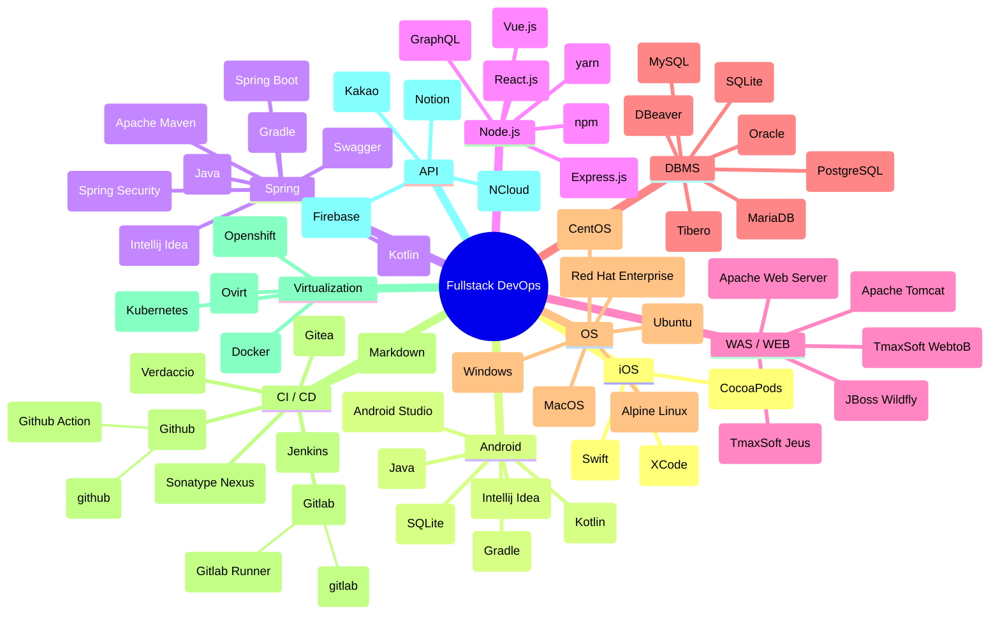

# {{ $frontmatter.description }} 관련

---

## <VPIcon icon="fas fa-bookmark"/>Bookmarks

<VPBanner
  title="Simple Icons"
  content="A 12 Lesson course teaching everything you need to know to start building Generative AI applications"
logo="https://camo.githubusercontent.com/d2b2c8edb50ea7bb4a8816e2210c7a319a75941732b21937c6bf720bc7009c93/68747470733a2f2f63646e2e73696d706c6569636f6e732e6f72672f73696d706c6569636f6e732f3030302f666666"
  :actions='[
    {
      text: "Visit Now",
      link: "https://simpleicons.org"
    }, {
      text: "Github",
      link: "https://github.com/simple-icons/simple-icons/blob/develop/slugs.md",
      type: "default"
    }
  ]'
/>

<VPBanner
  title="Awesome VuePress V2"
  content="A curated list of awesome things related to VuePress V2"
  logo="https://raw.githubusercontent.com/vuepress/awesome-vuepress/main/logo.png"
  :actions='[
    {
      text: "Visit Now",
      link: "https://github.com/vuepress/awesome-vuepress/blob/main/v2.md"
    }, {
      text: "Github",
      link: "https://github.com/vuepress/awesome-vuepress",
      type: "default"
    }, {
      text: "Icon support",
      link: "https://vuepress-theme-hope.gitee.io/v1/guide/interface/icon.html#featured-icons"
    }, {
      text: "Markdown Enhance",
      link: "https://plugin-md-enhance.vuejs.press/guide/",
      type: "default"
    }, {
      text: "VuePress Theme Hope",
      link: "https://theme-hope.vuejs.press/"
    },
  ]'
/>

::: details Browse slug(s)

<!-- @include: ./simple-icons.md -->

:::

::: tabs

@tab:active Package Manager

```component VPCard
{
  "title": "Homebrew — The Missing Package Manager for macOS (or Linux)",
  "desc": "The Missing Package Manager for macOS (or Linux).",
  "link": "https://brew.sh/",
  "logo": "https://brew.sh/assets/img/homebrew.svg",
  "background": "rgba(46,42,36,0.2)"
}
```

<SiteInfo
  name="Chocolatey Software | Packages"
  desc="Chocolatey is software management automation for Windows that wraps installers, executables, zips, and scripts into compiled packages. Chocolatey integrates w/SCCM, Puppet, Chef, etc. Chocolatey is trusted by businesses to manage software deployments."
  url="https://community.chocolatey.org/packages"
  logo="https://community.chocolatey.org/content/images/global-shared/logo.svg"
  preview="https://community.chocolatey.org/content/images/global-shared/facebook-share.png"/>

<SiteInfo
  name="Browse the winget repository - winstall"
  desc="Bulk install Windows apps quickly with Windows Package Manager."
  url="https://winstall.app/"
  logo="https://winstall.app/logo192.png"
  preview="https://winstall.app/cover.png"/>

```component VPCard
{
  "title": "Scoop Apps",
  "desc": "Scoop Apps is an online package browser for Scoop, the command-line installer for Windows",
  "link": "https://bjansen.github.io/scoop-apps/main/",
  "logo": "https://bjansen.github.io/scoop-apps/favicon.ico",
  "background": "rgba(42,42,41,0.2)"
}
```

```component VPCard
{
  "title": "crates.io: Rust Package Registry",
  "desc": "The Rust community’s crate registry",
  "link": "https://crates.io/",
  "logo": "https://crates.io/favicon.ico",
  "background": "rgba(247,203,84,0.2)"
}
```

<SiteInfo
  name="PyPI · The Python Package Index"
  desc="The Python Package Index (PyPI) is a repository of software for the Python programming language."
  url="https://pypi.org/"
  logo="https://pypi.org/static/images/favicon.35549fe8.ico"
  preview="https://pypi.org/static/images/twitter.abaf4b19.webp"/>

<SiteInfo
  name="Microsoft Store - Generation Project (v1.2.3) [by @rgadguard & mkuba50]"
  desc="Online link generator for Microsoft Store. You can use it to get links to almost all apps, games, themes from the Microsoft Store."
  url="https://store.rg-adguard.net/"
  logo="https://store.rg-adguard.net/favicon.ico"
  preview="https://store.rg-adguard.net/img/Store.png"/>

<SiteInfo
  name="Helm"
  desc="Helm - The Kubernetes Package Manager."
  url="https://helm.sh/"
  logo="https://helm.sh/img/favicon-152.png"
  preview="https://helm.sh/img/og-image.png"/>

<SiteInfo
  name="Artifact Hub"
  desc="Find, install and publish Cloud Native packages"
  url="https://artifacthub.io/"
  logo="https://artifacthub.io/static/media/logo_v2.png"
  preview="https://artifacthub.io/static/media/artifactHub_v2.png"/>

<SiteInfo
  name="Swift Package Index"
  desc="The Swift Package Index is the place to find the best Swift packages. Indexing metadata from 7,605 packages packages."
  url="https://swiftpackageindex.com/"
  logo="https://swiftpackageindex.com/images/logo-tiny.png"
  preview="https://swiftpackageindex.com/images/logo.png"/>

<SiteInfo
  name="OpenTofu Registry"
  desc="A fast and easy-to-use UI for quickly browsing and viewing OpenTofu modules and providers."
  url="https://search.opentofu.org/"
  logo="https://search.opentofu.org/favicon.ico"
  preview="https://search.opentofu.org/open-graph.png"/>

<!-- END:  Package Manager -->

@tab Programming Tools - General

```component VPCard
{
  "title": "Free Public APIs",
  "desc": "A collection of Free Public APIs for Students and Developers. Tested every single day.",
  "link": "https://freepublicapis.com/",
  "logo": "https://www.freepublicapis.com/favicon.ico",
  "background": "rgba(255,107,0,0.2)"
}
```

<SiteInfo
  name="delve"
  desc="Go down rabbit holes"
  url="https://delve.a9.io/"
  logo="https://delve.a9.io/logo.svg"
  preview="https://delve.a9.io/card.png"/>

```component VPCard
{
  "title": "CyberChef",
  "desc": "The Cyber Swiss Army Knife - a web app for encryption, encoding, compression and data analysis",
  "link": "https://gchq.github.io/CyberChef",
  "logo": "https://raw.githubusercontent.com/gchq/CyberChef/master/src/web/static/images/logo/cyberchef.svg",
  "background": "rgba(24,116,206,0.2)"
}
```

```component VPCard
{
  "title": "IT Tools - Handy online tools for developers",
  "desc": "Collection of handy online tools for developers, with great UX. IT Tools is a free and open-source collection of handy online tools for developers & people working in IT.",
  "link": "https://it-tools.tech/",
  "logo": "https://it-tools.tech/favicon-32x32.png",
  "background": "rgba(64,113,109,0.2)"
}
```

```component VPCard
{
  "title": "web code tools",
  "desc": "The best code generators for developers",
  "link": "https://webcode.tools/",
  "logo": "https://webcode.tools/favicon.png",
  "background": "rgba(18,18,18,0.2)"
}
```

```component VPCard
{
  "title": "SmallDev.tools",
  "desc": "FREE tools for developers like encoder/decoder, HTML/CSS/Javascript formatters, minifiers, fake or test data generators & much more.",
  "link": "https://smalldev.tools/",
  "logo": "https://smalldev.tools/favicon.png",
  "background": "rgba(246,248,251,0.2)"
}
```

```component VPCard
{
  "title": "Saaze",
  "desc": "An all-inclusive, flat-file CMS for simple websites and blogs",
  "link": "https://saaze.dev",
  "logo": "https://saaze.dev/assets/favicon.png",
  "background": "rgba(42,38,87,0.2)"
}
```

```component VPCard
{
  "title": "Timelock Encryption",
  "desc": "Send secrets into the future…",
  "link": "https://timelock.dev/",
  "logo": "🔒",
  "background": "rgba(33,37,41,0.2)"
}
```

```component VPCard
{
  "title": "Unify: Chat",
  "desc": "...",
  "link": "https://unify.ai/chat?default=true",
  "logo": "https://unify.ai/chat/icon.png?9ffe64af0b366700",
  "background": "rgba(0,184,40,0.2)"
}
```

```component VPCard
{
  "title": "Freehand",
  "desc": "Freehand – The all-in-one collaborative workspace<br/>Unlock your team's full potential – ideate, plan, execute, and track projects with Freehand",
  "link": "https://www.invisionapp.com",
  "logo": "https://marketing.invisionapp-cdn.com/www.invisionapp.com/global-assets/search/invision-search-logo.png",
  "background": "rgba(73,10,164,0.2) "
}
```

```component VPCard
{
  "title": "JSONGenerator",
  "desc": "Create Random JSON Data<",
  "link": "https://www.jsongenerator.io",
  "logo": "https://www.jsongenerator.io/favicon.ico",
  "background": "rgba(51,118,205,0.2)"
}
```

```component VPCard
{
  "title": "JSHint, a JavaScript Code Quality Tool",
  "desc": "JSHint, a JavaScript Code Quality Tool",
  "link": "https://jshint.com",
  "background": "rgba(170,238,204,0.2)"
}
```

```component VPCard
{
  "title": "SQL Workbench",
  "desc": "SQL Workbench - Rapid prototyping SQL Queries & Data Visualizations",
  "link": "https://sql-workbench.com/",
  "logo": "https://sql-workbench.com/icon.png",
  "background": "rgba(255,255,255,0.2)"
}
```

```component VPCard
{
  "title": "Mybatis Log Parser",
  "desc": "",
  "link": "https://comne.kr/mybatis/",
  "logo": "https://comne.kr/favicon.ico",
  "background": "rgba(18,18,18,0.2)"
}
```

```component VPCard
{
  "title": "Instant SQL Formatter & Beautifier Online",
  "desc": "Free online sql formatting tool, beautify sql code instantly for SQL Server, Oracle, DB2, MySQL, Sybase, Access and MDX",
  "link": "https://www.dpriver.com/pp/sqlformat.htm",
  "logo": "https://www.dpriver.com/pp/sqlpponline.png",
  "background": "rgba(255,198,79,0.2)"
}
```

```component VPCard
{
  "title": "Prompt Library",
  "desc": "Explore optimized prompts for a breadth of business and personal tasks.",
  "link": "https://docs.anthropic.com/claude/prompt-library",
  "logo": "https://files.readme.io/69d2014-favicon.ico",
  "background": "rgba(38,46,51,0.2)"
}
```

```component VPCard
{
  "title": "Kimchi Reader",
  "desc": "Your Ultimate Toolbox for Immersive Korean Language Learning",
  "link": "https://kimchi-reader.app/",
  "logo": "https://kimchi-reader.app/_app/immutable/assets/icon-full.4M8znj2G.svg",
  "background": "rgba(15,15,15,0.2)"
}
```

```component VPCard
{
  "title": "Anakin.ai",
  "desc": "Generate Content, Images, Videos, and Voice; Craft Automated Workflows, Custom AI Apps, and Intelligent AgentsYour exclusive AI app customization workstation",
  "link": "https://app.anakin.ai/discover",
  "logo": "https://app.anakin.ai/favicon.ico",
  "background": "rgba(158,119,255,0.2)"
}
```

```component VPCard
{
  "title": "Operator Lookup - Search JavaScript operators",
  "desc": "Friendly tutorials for developers. Focus on React, CSS, Animation, and more!",
  "link": "https://www.joshwcomeau.com/operator-lookup",
  "logo": "https://www.joshwcomeau.com/assets/favicon.png?v=4",
  "background": "rgba(97,123,255,0.2)"
}
```

```component VPCard
{
  "title": "Online SHA256 Encryption and Decryption",
  "desc": "Encrypt text to SHA256, or decrypt your SHA256 hashes with our free online database.",
  "link": "https://md5decrypt.net/en/Sha256/",
  "logo": "https://md5decrypt.net/includes/android-chrome-512x512.png",
  "background": "rgba(41,57,73,0.2)"
}
```

```component VPCard
{
  "title": "psyche-c",
  "desc": "Psyche-c is a compiler for incomplete C code being developed in our lab. It receives as an input a snippet[1]. From it, psyche-c produces a header file that, once #included into the original program, leads to compilable code[2].",
  "link": "http://cuda.dcc.ufmg.br/psyche-c/",
  "logo": "http://cuda.dcc.ufmg.br/psyche-c/include/imgs/desireeyes.JPG",
  "background": "rgba(213,31,35,0.2)"
}
```

<SiteInfo
  name="OpenRouter"
  desc="LLM router and marketplace"
  url="https://openrouter.ai/"
  logo="https://openrouter.ai/favicon.ico"
  preview="https://openrouter.ai/dynamic-og?pathname=default&title=OpenRouter&description=LLM%20router%20and%20marketplace"/>

```component VPCard
{
  "title": "Wasmphobia",
  "desc": "Wasmphobia analyzes a WebAssembly file and gives you a breakdown of what contributed to the module’s size. This is only really useful when the WebAssembly binary has DWARF debugging data embedded.",
  "link": "https://wasmphobia.surma.technology/",
  "background": "rgba(13,17,23,0.2)"
}
```

```component VPCard
{
  "title": "LINQPad - The .NET Programmer's Playground",
  "desc": "The .NET Programmer's Playground",
  "link": "https://www.linqpad.net/",
  "logo": "https://www.linqpad.net/favicon.ico",
  "background": "rgba(0,144,144,0.2)"
}
```

```component VPCard
{
  "title": "scratch",
  "desc": "Edna is a scratchpad and note taking application for developers and power users",
  "link": "https://edna.arslexis.io/#scratch",
  "logo": "https://edna.arslexis.io/favicon.ico",
  "background": "rgba(244,244,248,0.2)"
}
```

```component VPCard
{
  "title": "awsViz",
  "desc": "Awsviz.dev simplifying AWS IAM policies",
  "link": "https://www.awsviz.dev/",
  "logo": "https://www.awsviz.dev/logoawsviz.png",
  "background": "rgba(0,86,179,0.2)"
}
```

```component VPCard
{
  "title": "fakemail.stream - fakemail.stream",
  "desc": "A fake SMTP server for software integration testing.",
  "link": "https://fakemail.stream/",
  "logo": "https://fakemail.stream/favicon.ico",
  "background": "rgba(92,99,106,0.2)"
}
```

<SiteInfo
  name="ThinkPost"
  desc="ThinkPost is an Interactive split-panel diagramming, note-taking, and brainstorming tool for developers"
  url="https://thinkpost.io"
  logo="https://thinkpost.io/images/favicon.ico"
  preview="https://thinkpost.io/images/codebase/ogartwork.png"/>

<SiteInfo
  name="Node.js Toolbox"
  desc="Node.js Toolbox. Find actively maintained and popular packages in the Node.js ecosystem."
  url="https://nodejstoolbox.com/"
  logo="https://nodejstoolbox.com/apple-touch-icon.png"
  preview="https://nodejstoolbox.com/social-image.png"/>

```component VPCard
{
  "title": "Numscript Playground - Formance",
  "desc": "Numscript Playground",
  "link": "https://playground.numscript.org/",
  "logo": "https://playground.numscript.org/assets/favicon-xcf1rcG6.ico",
  "background": "rgba(1,40,45,0.2)"
}
```

<SiteInfo
  name="LocalFile.io"
  desc="파일관리 자동화 도구"
  url="https://localfile.io/ko/run/rename/"
  logo="https://localfile.io/favicon.svg"
  preview="https://localfile.io/ogp.png"/>

<SiteInfo
  name="Open Graph Preview"
  desc="Preview your site's Open Graph cards across popular social media and messaging apps"
  url="https://opengraph.ing/preview/"
  logo="https://opengraph.ing/images/icon-v1.png"
  preview="https://opengraph.ing/images/og-v1.png"/>

<SiteInfo
  name="WebCurate - Discover the Best Websites Online (Updated Daily)"
  desc="Find the best websites online with WebCurate, home to 2,300+ top, new websites and tools you never knew existed. Daily updated & hand-curated for the community."
  url="https://webcurate.co/"
  logo="https://webcurate.co/assets/images/favicon/favicon-16x16.png?v.6"
  preview="https://webcurate.co/assets/images/og/main-og-img.png?15"/>

<SiteInfo
  name="Awesome Shadcn UI"
  desc="With 13 Categories and Over 200 Resources, It’s Easy To Access Shadcn’s Most Valuable Resources."
  url="https://shadcn.batchtool.com"
  logo="https://shadcn.batchtool.com/favicon.ico"
  preview="https://shadcn.batchtool.com/og.jpg"/>

<SiteInfo
  name="Gitingest"
  desc="Replace 'hub' with 'ingest' in any Github Url for a prompt-friendly text"
  url="http://gitingest.com/"
  logo="http://gitingest.com/static/favicon-64.png"
  preview="http://gitingest.com/static/og-image.png"/>

<SiteInfo
  name="GitDiagram - Repository to Diagram in Seconds"
  desc="Turn any GitHub repository into an interactive diagram for visualization."
  url="https://gitdiagram.com/"
  logo="https://gitdiagram.com/favicon.ico"
  preview="https://gitdiagram.com/og-image.png"/>

<SiteInfo
  name="lmno.lol"
  desc="Wholesome blogs minus the yucky bits of the modern web"
  url="https://lmno.lol/"
  logo="https://lmno.lol/favicon-64.png"
  preview="https://lmno.lol/share.png"/>

```component VPCard
{
  "title": "Terminal Apps",
  "desc": "A collection of awesome TUI apps from around the web.",
  "link": "https://terminal-apps.dev/",
  "logo": "https://terminal-apps.dev/favicon.svg",
  "background": "rgba(244,114,182,0.2)"
}
```

<SiteInfo
  name="Dev Tools"
  desc="A comprehensive list of development tools"
  url="https://freetool.vercel.app/"
  logo="https://freetool.vercel.app/fav.png"
  preview="https://freetool.vercel.app/social.png"/>

```component VPCard
{
  "title": "Defuddle Playground",
  "desc": "",
  "link": "https://kepano.github.io/defuddle",
  "logo": "",
  "background": "rgba(10,10,10,0.2)"
}
```

<SiteInfo
  name="Index - ReadmeAI"
  desc="ReadmeAI: Your AI-powered documentation assistant. Designed for simplicity, customization, and developer productivity."
  url="https://docs.readme-ai.com"
  logo="https://eli64s.github.io/readme-ai/assets/images/favicon.png"
  preview="https://docs.readme-ai.com/assets/images/social/index.png"/>

<SiteInfo
  name="VERT.sh — Free, fast, and awesome file converter"
  desc="With VERT you can quickly convert any image, video and audio file. No ads, no tracking, open source, and all processing (other than video) is done on your device."
  url="https://vert.sh/"
  logo="https://vert.sh/favicon.png"
  preview="https://vert.sh/_app/immutable/assets/VERT_Feature.D5UIwpMt.webp"/>

<!-- END: Programming Tools - General -->

@tab Design & Image

<SiteInfo
  name="Frame0 | Sketch your app ideas without stress"
  desc="Make hand-drawn style wireframes quickly and easily."
  url="https://frame0.app/"
  logo="https://frame0.app/favicon.svg"
  preview="https://frame0.app/og.jpg"/>

<SiteInfo
  name="Font Awesome"
  desc="The internet's icon library + toolkit. Used by millions of designers, devs, & content creators. Open-source. Always free. Always awesome."
  url="https://fontawesome.com/search"
  logo="https://fontawesome.com/images/favicon/icon.svg"
  preview="https://img.fortawesome.com/1ce05b4b/open-graph-search.png"/>

<SiteInfo
  name="Iconbuddy — 200K+ open source free svg icons"
  desc="Iconbuddy is a search engine that allows you to search, download, customize, and edit over 200,000 open source svg icons for free."
  url="https://iconbuddy.app"
  logo="https://c1.tablecdn.com/iconbuddy/iconbuddy-logo.png"
  preview="https://c1.tablecdn.com/iconbuddy/banner-og.png"/>

<SiteInfo
  name="Boxicons : Premium web friendly icons for free"
  desc="Boxicons is a free collection of carefully crafted open source icons. Each icon is designed on a 24px grid with the material guidelines"
  url="https://boxicons.com/"
  logo="https://boxicons.com/static/favicon.ico?v=13"
  preview="http://boxicons.com/static/img/og-image.png"/>

<SiteInfo
  name="Tabler Icons: 5250+ free vector icons for web design - Tabler: Free and Open-Source HTML Dashboard Template"
  desc="Tabler Icons: 5253 free and open source SVG icons. Customizable size, color and stroke width. Packages for React, SolidJS, Vue, Figma, Svelte and others are available. Icons can be downloaded as PNG, Webfont, PDF or EPS files. All for free!"
  url="https://tabler.io/icons"
  logo="https://tabler.io/favicon.ico"
  preview="https://tabler.io/icons/opengraph-image-1v9qf3.png?a3eb50029318add4"/>

<SiteInfo
  name="Isocons"
  desc="Carefully crafted isometric icons."
  url="https://isocons.app/"
  logo="https://isocons.app/favicon.ico"
  preview="https://isocons.app/og.jpg"/>

<SiteInfo
  name="Cron job editor: multiple cron jobs, calendar view, AWS & Vercel cron support | CronTool"
  desc="With CronTool you can edit, debug and view one or multiple crontab / cron expressions on a calendar - all online & free forever. The last cron expression editor you'll ever need. Share cron jobs with your team, write AWS & Vercel cron jobs and more."
  url="https://tool.crontap.com/cronjob-debugger"
  logo="https://tool.crontap.com/cronjob-debugger/apple-touch-icon.png"
  preview="https://tool.crontap.com/cronjob-debugger/api/ogImg"/>

```component VPCard
{
  "title": "Phosphor Icons",
  "desc": "A flexible icon family for interfaces, diagrams, presentations — whatever, really.",
  "link": "https://phosphoricons.com/",
  "logo": "https://phosphoricons.com/favicon.ico",
  "background": "rgba(202,227,108,0.2)"
}
```

<SiteInfo
  name="Material Symbols & Icons - Google Fonts"
  desc="Material Symbols are our newest icons consolidating over 2,500 glyphs in a single font file with a wide range of design variants."
  url="https://fonts.google.com/icons"
  logo="https://www.gstatic.com/images/icons/material/apps/fonts/1x/catalog/v5/favicon.svg"
  preview="https://www.gstatic.com/images/icons/material/apps/fonts/1x/material-symbols/material_symbols.jpg"/>

<SiteInfo
  name="Bootstrap Icons · Official open source SVG icon library for Bootstrap"
  desc="Official open source SVG icon library for Bootstrap"
  url="https://icons.getbootstrap.com/"
  logo="https://icons.getbootstrap.com/assets/img/favicons/apple-touch-icon.png"
  preview="https://icons.getbootstrap.com/assets/img/bootstrap-icons-social.png"/>

```component VPCard
{
  "title": "Heroicons",
  "desc": "Beautiful hand-crafted SVG icons, by the makers of Tailwind CSS.",
  "link": "https://heroicons.com",
  "logo": "https://heroicons.com/_next/static/media/apple-touch-icon.822687be.png",
  "background": "rgb(242,236,250,0.2)"
}
```

```component VPCard
{
  "title": "icons8",
  "desc": "Download 1,349,800 free icons (SVG, PNG)",
  "link": "https://icons8.com/",
  "logo": "https://maxst.icons8.com/vue-static/icon/favicon/icons8_fav_32%C3%9732.png",
  "background": "rgba(84,174,80,0.2)"
}
```

<SiteInfo
  name="Reshot | Free icons & illustrations"
  desc="Design freely with instant downloads of curated SVG icons and vector illustrations. All free with commercial licensing. No attribution required."
  url="https://www.reshot.com/"
  logo="https://www.reshot.com/build/favicons/apple-icon-180x180-1cc7650c518e0d48ee137a4f222d4036e31fcaeea0579c1b3c277a56a84c3620.png"
  preview="https://www.reshot.com/static/global/og/reshot-og-default.png"/>

```component VPCard
{
  "title": "Codeimg.io",
  "desc": "Create and share beautiful images of your source code.",
  "link": "https://codeimg.io/",
  "logo": "https://codeimg.io/img/favicon/favicon.ico",
  "background": "rgba(26,104,209,0.2)"
}
```

```component VPCard
{
  "title": "Eraser",
  "desc": "♟️The Whiteboard for Engineering Teams",
  "link": "https://app.eraser.io",
  "logo": "https://app.eraser.io/favicon.svg",
  "background": "rgba(23,23,23,0)"
}
```

```component VPCard
{
  "title": "Diagrams - Diagram as Code",
  "desc": "Draw the cloud system architecture in Python code",
  "link": "https://diagrams.mingrammer.com",
  "logo": "https://diagrams.mingrammer.com/img/diagrams.ico",
  "background": "rgba(94,115,229,0.2)"
}
```

```component VPCard
{
  "title": "YT Pics",
  "desc": "Download pictures from Youtube videos",
  "link": "https://www.ytpics.com/",
  "logo": "https://www.ytpics.com/images/image-download.svg",
  "background": "rgba(17,17,17,0.2)"
}
```

```component VPCard
{
  "title": "v0.dev",
  "desc": "Generate UI with simple text prompts. Copy, paste, ship.",
  "link": "https://v0.dev/",
  "logo": "https://v0.dev/icon-19iptc.svg?94ebf4f1268986e0",
  "background": "rgba(24,24,27,0.2)"
}
```

```component VPCard
{
  "title": "TechIcons",
  "desc": "Download, copy and paste tech icons in SVG and PNG format for your projects.",
  "link": "https://techicons.dev/",
  "logo": "https://techicons.dev/tech-icons-logo.svg",
  "background": "rgba(48,131,220,0.2)"
}
```

```component VPCard
{
  "title": "무료 벡터 아이콘 — 1,346,800개의 아이콘 다운로드 (SVG, PNG)",
  "desc": "그래픽 디자인, UX, 소셜 미디어 및 모바일 용 무료 아이콘을 다운로드하세요. 일관된 디자인과 품질로 제공되는 정적 또는 애니메이션 아이콘을 검색해 사용해 보세요. PNG, SVG, GIF, AE 형식으로 지원됩니다.",
  "link": "https://icons8.kr/icons",
  "logo": "https://maxst.icons8.com/vue-static/icon/favicon/icons8_fav_32×32.png",
  "background": "rgba(31,177,65,0.2)"
}
```

<SiteInfo
  name="Notion Avatar Maker"
  desc="An online tool for making notion-style avatars."
  url="https://notion-avatar.vercel.app/en"
  logo="https://notion-avatar.vercel.app/favicon/android-icon-192x192.png"
  preview="https://i.imgur.com/F5R0K03.png"/>

<SiteInfo
  name="SVG Repo - Free SVG Vectors and Icons"
  desc="Free Vectors and Icons in SVG format. ✅ Download free mono or multi color vectors for commercial use. Search in 500.000+ Free SVG Vectors and Icons."
  url="https://www.svgrepo.com/"
  logo="https://www.svgrepo.com/favicon.ico"
  preview="https://www.svgrepo.com/social.png"/>

```component VPCard
{
  "title": "네이버 - QR코드",
  "desc": "나만의 QR코드로 간편하게 정보를 담아보세요",
  "link": "https://qr.naver.com",
  "logo": "https://naver.com/favicon.ico",
  "background": "rgba(3,199,90,0.2)"
}
```

```component VPCard
{
  "title": "PDFEquips | Free Online PDF Tools",
  "desc": "Powerful PDF tools to easily manage documents. You can merge, split, compress, transform, rotate, open and add watermarks to your files with just a few clicks.",
  "link": "https://www.pdfequips.com/",
  "logo": "https://www.pdfequips.com/images/icons/android-icon-192x192.png",
  "background": "rgba(252,39,28,0.2)"
}
```

```component VPCard
{
  "title": "Brand New",
  "desc": "Opinions on corporate and brand identity work",
  "link": "https://www.underconsideration.com/brandnew",
  "logo": "https://www.underconsideration.com/brandnew/wp/wp-content/themes/make/_favicon/apple-touch-icon.png",
  "background": "rgba(250,40,55,0.2)"
}
```

<SiteInfo
  name="Illustrations | unDraw"
  desc="The design project with open-source illustrations for any idea you can imagine and create. Create beautiful websites, products and applications with your color, for free."
  url="https://undraw.co/illustrations"
  logo="https://undraw.co/favicon.ico"
  preview="https://42f2671d685f51e10fc6-b9fcecea3e50b3b59bdc28dead054ebc.ssl.cf5.rackcdn.com/v2/undraw_social_20.png"/>

<SiteInfo
  name="Hero Patterns | Free repeatable SVG background patterns for your web projects"
  desc="A collection of free repeatable SVG background patterns for you to use on your digital projects."
  url="https://heropatterns.com/"
  preview="https://heropatterns.com/img/twitter-preview.png"/>

```component VPCard
{
  "title": "Noun Project: Free Icons & Stock Photos for Everything",
  "desc": "Noun Project has the most diverse collection of free icons and stock photos. Download SVG and PNG. Over 5 million art-quality icons and free photos.",
  "link": "https://thenounproject.com/",
  "logo": "https://thenounproject.com/apple-touch-icon.png",
  "background": "rgba(19,21,31,0.2)"
}
```

```component VPCard
{
  "title": "Math API",
  "desc": "Place LaTeX Math Equation on anywhere as img tag",
  "link": "https://math.vercel.app/home",
  "background": "rgba(86,16,245,0.2)"
}
```

```component VPCard
{
  "title": "PDF to SVG | CloudConvert",
  "desc": "PDF to SVG Converter - CloudConvert is a free & fast online file conversion service.",
  "link": "https://cloudconvert.com/pdf-to-svg",
  "logo": "https://cloudconvert.com/images/logo_flat_32.png",
  "background": "rgba(152,47,45,0.2)"
}
```

```component VPCard
{
  "title": "SVG Artista",
  "desc": "SVG Artista - SVG Drawing Animation Generator",
  "link": "https://svgartista.net",
  "logo": "https://svgartista.net/images/app-icon/safari-pinned-tab.svg",
  "background": "rgba(41,40,41,0.2)"
}
```

```component VPCard
{
  "title": "Animista - On-Demand CSS Animations Library",
  "desc": "Animista is a CSS animation library and a place where you can play with a collection of ready-made CSS animations and download only those you will use.",
  "link": "https://animista.net/play/basic/rotate-90",
  "logo": "https://animista.net/images/animista-logo-small.svg",
  "background": "rgba(237,102,107,0.2)"
}
```

```component VPCard
{
  "title": "CSS Glow Generator - CSS Bud",
  "desc": "A modern and clearn CSS Glow Generator. Custom colors, transparency, and blurs for your creative needs. Enjoy!",
  "link": "https://cssbud.com/css-generator/css-glow-generator/",
  "logo": "https://cssbud.com/wp-content/uploads/2020/04/cssbud-logo.png",
  "background": "rgba(176,165,225,0.2)"
}
```

```component VPCard
{
  "title": "cssbuttons.app | Over 60+ Free CSS Buttons To Use",
  "desc": "Collection of over 60+ handpicked and custom made CSS buttons for your website.",
  "link": "https://cssbuttons.app/",
  "logo": "https://cssbuttons.app/favicon.ico",
  "background": "rgba(16,16,16,0.2)"
}
```

```component VPCard
{
  "title": "BGJar | Free svg background image generator for your websites",
  "desc": "Free svg background generator for your websites, blogs and app.",
  "link": "https://bgjar.com",
  "logo": "https://bgjar.com/bgjar.svg",
  "background": "rgba(14,42,71,0.2)"
}
```

```component VPCard
{
  "title": "Neumorphism/Soft UI CSS shadow generator",
  "desc": "CSS code generator that will help with colors, gradients and shadows to adapt this new design trend or discover its posibilities.",
  "link": "https://neumorphism.io/",
  "logo": "https://neumorphism.io/favicon.ico",
  "background": "rgba(224,224,224,0.2)"
}
```

```component VPCard
{
  "title": "Easing Gradients",
  "desc": "Supercharge your gradients with non-linear color mix and custom color spaces.",
  "link": "https://larsenwork.com/easing-gradients/",
  "logo": "https://larsenwork.com/favicon.ico",
  "background": "rgba(216,45,144,0.2)"
}
```

```component VPCard
{
  "title": "Hamburgers by Jonathan Suh",
  "desc": "Tasty CSS-animated Hamburgers",
  "link": "https://jonsuh.com/hamburgers/",
  "logo": "https://jonsuh.com/favicon.ico",
  "background": "rgba(244,244,244,0.2)"
}
```

```component VPCard
{
  "title": "Smooth Shadow",
  "desc": "Make a smooth css shadow",
  "link": "https://shadows.brumm.af/",
  "logo": "https://shadows.brumm.af/logo192.png",
  "background": "rgba(76,138,244,0.2)"
}
```

```component VPCard
{
  "title": "Glassmorphism CSS Generator | SquarePlanet | SquarePlanet",
  "desc": "Glassmorphism is a unified name for the popular Frosted Glass aesthetic.",
  "link": "https://hype4.academy/tools/glassmorphism-generator",
  "logo": "https://hype4.academy/favicon/android-icon-192x192.png",
  "background": "rgba(50,48,52,0.2)"
}
```

```component VPCard
{
  "title": "CSS Tools Online | 10015 Tools",
  "desc": "Looking to spruce up your website's style? Check out 10015.io's online CSS Tools! With a variety of online tools available, you can easily customize your site's look and feel. And best of all, our CSS tools are free to use!",
  "link": "https://10015.io/css-tools",
  "logo": "https://10015.io/brand/logo-on-light.svg",
  "background": "rgba(72,75,245,0.2)"
}
```

```component VPCard
{
  "title": "Free Favicon Maker",
  "desc": "Free Favicon Maker — Create SVG & PNG favicon in seconds!",
  "link": "https://formito.com/tools/favicon",
  "logo": "https://formito.com/favicon.ico",
  "background": "rgba(123,111,224,0.2)"
}
```

```component VPCard
{
  "title": "Database diagram",
  "desc": "Database Diagram Tool",
  "link": "https://databasediagram.com/app",
  "logo": "https://databasediagram.com/img/databasediagram.png",
  "background": "rgba(39,39,87,0.2)"
}
```

```component VPCard
{
  "title": "chalk.ist",
  "desc": "Create beautiful images of your source code",
  "link": "https://chalk.ist/",
  "logo": "https://chalk.ist/apple-touch-icon.png",
  "background": "rgba(11,11,13,0.2)"
}
```

```component VPCard
{
  "title": "Cytoscape.js",
  "desc": "Graph theory / network library for analysis and visualisation - compatible with CommonJS/Node.js/Browserify/Webpack, AMD/Require.js, npm, Bower, jspm, Meteor/Atmosphere, jQuery, and plain JS/JavaScript",
  "link": "https://js.cytoscape.org/",
  "logo": "https://js.cytoscape.org/img/cytoscape-logo.svg",
  "background": "rgba(247,223,30,0.2)"
}
```

```component VPCard
{
  "title": "D2 Playground",
  "desc": "An online runner to play, learn, and create with D2, the modern diagram scripting language that turns text to diagrams.",
  "link": "https://play.d2lang.com",
  "logo": "https://play.d2lang.com/assets/images/og.png",
  "background": "rgba(87,121,245,0.2)"
}
```

```component VPCard
{
  "title": "Hexcodle - The Daily Hexcode Guessing Game!",
  "desc": "Can you guess today's hexcode color? Challenge your color instincts and decode the hexcode with Hexcodle! Inspired by Wordle, but for color enthusiasts.",
  "link": "https://hexcodle.com/",
  "logo": "https://hexcodle.com/favicon.ico",
  "background": "rgba(227,232,239,0.2)"
}
```

```component VPCard
{
  "title": "shadeup.dev",
  "desc": "The power of WebGPU with just a few lines of code",
  "link": "https://shadeup.dev/browse",
  "logo": "https://shadeup.dev/logo.svg",
  "background": "rgba(74,39,116,0.2)"
}
```

```component VPCard
{
  "title": "Color Lisa - Curated Color Palette Masterpieces.",
  "desc": "Color Lisa is a curated list of inspiring color palettes based famous work of the world's greatest artists. Each palette was painstakingly created by color obsessed designers, artists, museum curators, and masters of color theory. ",
  "link": "https://colorlisa.com/",
  "logo": "https://colorlisa.com/icons/apple-touch-icon-152x152.png",
  "background": "rgba(9,175,253,0.2)"
}
```

```component VPCard
{
  "title": "Vectorpea | Online Vector Editor",
  "desc": "Vectorpea Online Vector Editor lets you edit vector graphics, AI, SVG and PDF files!",
  "link": "https://www.vectorpea.com/",
  "logo": "https://www.vectorpea.com/icon512.png",
  "background": "rgba(101,165,0,0.2)"
}
```

```component VPCard
{
  "title": "Typ.io: Fonts that go together",
  "desc": "Be better at typography.",
  "link": "https://typ.io/",
  "logo": "https://typ.io/typio.svg",
  "background": "rgba(255,255,255,0.2)"
}
```

<SiteInfo
  name="카페24 상업용 무료 폰트 다운로드 - 카페24"
  desc="라이선스 걱정 없이 어디서나 사용할 수 있는 상업용 무료 폰트"
  url="https://fonts.cafe24.com/"
  logo="https://img.cafe24.com/favicon/cafe24.ico"
  preview="https://img.cafe24.com/images/common/og_image.png"/>

```component VPCard
{
  "title": "Windows 98 Icon Viewer",
  "desc": "",
  "link": "https://win98icons.alexmeub.com/",
  "logo": "https://win98icons.alexmeub.com/favicon.ico",
  "background": "rgba(0,128,128,0.2)"
}
```

```component VPCard
{
  "title": "Ugly Avatar",
  "desc": "CREATED BY XUAN TANG, MORE INFO AT TXSTC55.GITHUB.IO",
  "link": "https://txstc55.github.io/ugly-avatar/",
  "logo": "https://txstc55.github.io/ugly-avatar/avatar.png",
  "background": "rgba(255,253,208,0.2)"
}
```

```component VPCard
{
  "title": "Browse Fonts - Google Fonts",
  "desc": "Making the web more beautiful, fast, and open through great typography",
  "link": "https://fonts.google.com/",
  "logo": "https://www.gstatic.com/images/icons/material/apps/fonts/1x/catalog/v5/favicon.svg",
  "background": "rgba(32,33,36,0.2)"
}
```

```component VPCard
{
  "title": "Visual Dictionary and Thesaurus | Graphwords.com",
  "desc": "Graphwords.com is a visual thesaurus and dictionary to help you explore English words. Find meanings of words and their associations in easy way using this online thesaurus tool. It's a tool that produces word maps that blossom with related words, branching out to synonyms and definitions.",
  "link": "https://graphwords.com/",
  "logo": "https://graphwords.com/img/favicon.png",
  "background": "rgba(176,208,209,0.2)"
}
```

```component VPCard
{
  "title": "PromptHero - Search prompts for Stable Diffusion, ChatGPT & Midjourney",
  "desc": "The #1 website for Artificial Intelligence and Prompt Engineering. Search the world's best AI prompts for models like Stable Diffusion, ChatGPT, Midjourney…",
  "link": "https://prompthero.com/",
  "logo": "https://prompthero.com/favicon/apple-touch-icon.png",
  "background": "rgba(115,67,89.0.2)"
}
```

```component VPCard
{
  "title": "AutoDraw",
  "desc": "Fast drawing for everyone. AutoDraw pairs machine learning with drawings from talented artists to help you draw stuff fast.",
  "link": "https://autodraw.com",
  "logo": "https://www.autodraw.com/assets/images/favicon.png",
  "background": "rgba(17,122,220,0.2)"
}
```

```component VPCard
{
  "title": "Ok! So... Draw online",
  "desc": "The drawing app to express, grasp, and organize your thoughts and ideas",
  "link": "https://okso.app/",
  "logo": "https://okso.app/favicon.ico",
  "background": "rgba(51,51,51,0.2)"
}
```

```component VPCard
{
  "title": "HIRA e-Book",
  "desc": "이북, e-book, E-BOOK, e-북, 전자책, 전자책솔루션, 이북솔루션, e-book솔루션, 모바일책, 전자책출판, viewer, epub3, epubviewer",
  "link": "https://www.hira.or.kr/sViewer/index.do",
  "logo": "https://www.hira.or.kr/sViewer/favicon.ico",
  "background": "rgba(232,232,234,0.2)"
}
```

<SiteInfo
  name="Font In Logo - Search Engine for Logos and Fonts"
  desc="Search & find FONTS used by World Brands in their logos, such as Nike, Tesla, Chanel, Adidas, Youtube, BMW font, New York Times, Sony, Nvidia and more."
  url="https://www.fontinlogo.com/"
  logo="https://cdn.prod.website-files.com/5ee732bebd98391c46ff27c4/5eedd2af2a1f376faa86b181_Favicon%20F%3EL.png"
  preview="https://cdn.prod.website-files.com/5ee732bebd98391c46ff27c4/5ef2099e4056018c8fdfbe78_1.jpg"/>

```component VPCard
{
  "title": "공공누리",
  "desc": "",
  "link": "https://www.kogl.or.kr/index.do",
  "logo": "https://www.kogl.or.kr/static/kogl/img/common/logo.png",
  "background": "rgba(0,165,137,0.2)"
}
```

```component VPCard
{
  "title": "OCR PDFs and images directly in your browser",
  "desc": "This tool runs entirely in your browser. No files are uploaded to a server.",
  "link": "https://tools.simonwillison.net/ocr",
  "logo": "https://simonwillison.net/favicon.ico",
  "background": "rgba(97,71,130,0.2)"
}
```

```component VPCard
{
  "title": "CSS Code Generators",
  "desc": "Pick from the available CSS generators. Set the desired options quickly with sliders, color pickers and test the codes with the interactive HTML-CSS editor",
  "link": "https://html-css-js.com/css/generator/",
  "logo": "https://html-css-js.com/favicon.ico",
  "background": "rgba(45,99,139,0.2)"
}
```

```component VPCard
{
  "title": "Popular Color Palettes",
  "desc": "Popular Color palettes created by color-hex users, every palette has 5 color and rgb values listed.",
  "link": "https://www.color-hex.com/color-palettes/popular.php",
  "logo": "https://www.color-hex.com/favicon.ico",
  "background": "rgba(248,248,248,0.2)"
}
```

```component VPCard
{
  "title": "HEIC/HEIF to JPG Converter",
  "desc": "Convert multiple HEIC/HEIF images to JPG at once, in your browser.",
  "link": "https://heif.pages.dev/jpg/",
  "background": "rgba(110,67,184,0.2)"
}
```

<SiteInfo
  name="pattern.css - Background Patterns in CSS"
  desc="CSS only library to fill your empty background with beautiful patterns."
  url="https://bansal.io/pattern-css"
  logo="https://avatars.githubusercontent.com/u/64239773?v=4"
  preview="https://bansal.io/assets/images/pattern-css-preview.jpg"/>

```component VPCard
{
  "title": "디자인 플랫폼 미리캔버스",
  "desc": "디자인 작업이 필요한가요? 5만개 이상의 무료 템플릿으로 간편하고 편하게 원하는 디자인을 만들 수 있어요.",
  "link": "https://www.miricanvas.com/ko",
  "logo": "https://resource.miricanvas.com/2_0/image/favicon/android-chrome-192x192.png",
  "background": "rgba(66,187,201,0.2)"
}
```

```component VPCard
{
  "title": "Anchor position tool",
  "desc": "…",
  "link": "https://anchor-tool.com/",
  "background": "rgba(26,108,0,0.2)"
}
```

```component VPCard
{
  "title": "Video to animated GIF converter",
  "desc": "Upload your video, select the part you want to convert and instanlty create a GIF in good quality for free and without watermarks.",
  "link": "https://ezgif.com/video-to-gif",
  "logo": "https://ezgif.com/favicon.ico",
  "background": "rgba(41,41,41,0.2)"
}
```

```component VPCard
{
  "title": "제목없음 - 그림판",
  "desc": "Classic MS Paint in the browser, with extra features",
  "link": "https://jspaint.app/",
  "logo": "https://jspaint.app/favicon.ico",
  "background": "rgba(192,192,192,0.2)"
}
```

```component VPCard
{
  "title": "Lorem Picsum",
  "desc": "Lorem Ipsum... but for photos",
  "link": "https://picsum.photos/",
  "logo": "https://picsum.photos/assets/images/favicon/favicon-32x32.png",
  "background": "rgba(26,26,26,0.2)"
}
```

```component VPCard
{
  "title": "Pattern Monster - SVG Pattern Generator",
  "desc": "A simple online pattern generator to create repeatable SVG patterns. Perfect for website backgrounds, apparel, branding, packaging design and more.",
  "link": "https://pattern.monster/",
  "logo": "https://pattern.monster/favicon.png",
  "background": "rgba(128,90,213,0.2)"
}
```

```component VPCard
{
  "title": "Webflow CSS Playground",
  "desc": "Build with the power of code — without writing any",
  "link": "http://playground.webflow.com/",
  "logo": "http://playground.webflow.com/favicon.ico",
  "background": "rgba(51,51,51,0.2)"
}
```

<SiteInfo
  name="tldraw"
  desc="A free and instant collaborative diagramming tool."
  url="https://www.tldraw.com/"
  logo="https://www.tldraw.com/favicon.svg"
  preview="https://www.tldraw.com/social-og.png"/>

<SiteInfo
  name="Classic Console Neue TrueType Font - ASCII 8x16 Reproduction - DeeJayy"
  desc="Classic Console Neue TrueType Font ASCII 8x16 DOS Command Line Font"
  url="https://webdraft.hu/fonts/classic-console/"
  preview="http://webdraft.eu/fonts/classic-console/sample-pictures/og-image.png"/>

```component VPCard
{
  "title": "CSS Stats",
  "desc": "Potentially interesting stats on stylesheets",
  "link": "https://cssstats.com/",
  "background": "rgba(0,0,0,0.2)"
}
```

```component VPCard
{
  "title": "Eva Icons - beautifully crafted Open Source UI icons for common actions and items.",
  "desc": "Eva Icons is a pack of 480 delightful icons available for free. Download Eva Icons to use them in your products for mobile and web apps. Available as SVG, PNG, Web Font and Sketch. Open Source, built by the Nebular team.",
  "link": "https://akveo.github.io/eva-icons/",
  "logo": "https://akveo.github.io/eva-icons/favicon.ico",
  "background": "rgba(51,102,255,0.2)"
}
```

<SiteInfo
  name="HTML Symbols, Entities, Characters and Codes — HTML Arrows"
  desc="Easily find HTML symbols, entities, characters and codes with ASCII, HEX, CSS and Unicode values for HTML arrow, ASCII arrow, and more in grid or table format."
  url="https://www.toptal.com/designers/htmlarrows/"
  logo="https://www.toptal.com/designers/htmlarrows/assets/images/favicon.ico"
  preview="https://www.toptal.com/designers/htmlarrows/assets/images/htmlarrows-hero-29eb905f.jpg"/>

<SiteInfo
  name="draw2app"
  desc="..."
  url="https://draw2app.pages.dev/"
  logo="https://draw2app.pages.dev/favicon.svg"
  preview="rgba(136,139,148,0.2"/>

```component VPCard
{
  "title": "ERD9 - Best Databse Modeling Tool",
  "desc": "Best Databse Modeling Tool",
  "link": "https://gujc71.github.io/erd9/",
  "logo": "https://gujc71.github.io/erd9/images/favicon.ico",
  "background": "rgba(214,226,251,0.2)"
}
```

<SiteInfo
  name="PIKIMOV ☆ Free web-based motion design and video editor"
  desc="Pikimov is a free web motion design editor"
  url="https://pikimov.com/"
  logo="https://pikimov.com/favicon.png"
  preview="https://pikimov.com/pikimov-cover.png"/>

<SiteInfo
  name="Convert SVG to PNG - SVG Viewer"
  desc="The ultimate SVG tool"
  url="https://www.svgviewer.dev/"
  logo="https://www.svgviewer.dev/svg-to-png"
  preview="https://www.svgviewer.dev/images/logo.svg"/>

```component VPCard
{
  "title": "CSS Grid Generator",
  "desc": "CSS Grid Generator - a user-friendly tool designed for web developers to effortlessly create customizable CSS grids for seamless web development.",
  "link": "https://cssgridgenerator.io/",
  "logo": "https://cssgridgenerator.io/favicon.ico",
  "background": "rgba(51,49,46,0.2)"
}
```

<SiteInfo
  name="무료 온라인 전자 서명 포함 PDF 서명"
  desc="전자 서명으로 문서에 온라인으로 서명할 수 있는 100% 무료 도구입니다. 가입이 필요 없습니다. 온라인으로 전자 서명을 생성하고 PDF에 서명하세요."
  url="https://smallpdf.com/kr/sign-pdf"
  logo="https://smallpdf.com/favicon.png"
  preview="https://smallpdf.com/assets/img/fb/sign.png"/>

<SiteInfo
  name="Editor - Stempad"
  desc="Try for free, no sign in required. Math, graphs, molecule sketches, code, chemistry, drawing, table, and more."
  url="https://www.stempad.io/editor"
  logo="https://www.stempad.io/favicon-196x196.png"
  preview="https://www.stempad.io/logo-square.png"/>

<SiteInfo
  name="Video Editing SDK - Rendley SDK"
  desc="A Video Editing SDK that works in any browser and performs rendering client-side, without the need for a server.  "
  url="https://app.rendley.com/login"
  logo="https://app.rendley.com/favicon/favicon.svg"
  preview="https://app.rendley.com/og/og-1200x630.png"/>

<SiteInfo
  name="Freesentation"
  desc="파워포인트 사용자를 위한 폰트, 프리젠테이션"
  url="https://freesentation.blog/"
  logo="https://framerusercontent.com/images/xuZFeXZZkyzf2T6Ltj4rFOo5vo.png"
  preview="https://framerusercontent.com/assets/HU3CSOvS9DOooJSP13to5Z2A1M.jpg"/>

```component VPCard
{
  "title": "typlr.app — web based font editor. Make your fonts online",
  "desc": "web based font editor. Make your fonts online",
  "link": "https://typlr.app/",
  "logo": "https://typlr.app/icons/typlr-icon-512.svg",
  "background": "rgba(97,48,173,0.2)"
}
```

```component VPCard
{
  "title": "Structurizr",
  "desc": "Visualise, document and explore your software architecture with Structurizr",
  "link": "https://structurizr.com/",
  "logo": "https://static.structurizr.com/img/favicon.png",
  "background": "rgba(8,66,123,0.2)"
}
```

<SiteInfo
  name="Image generation API - Bannerify"
  desc="Take your visuals to the next level with our automated image generation API. Perfect for social media, ecommerce, podcasts and more"
  url="https://bannerify.co/tools/remove-bg"
  logo="https://bannerify.co/favicon.svg"
  preview="https://ogcool.vercel.app/templates/v1/tpl_B11s5ULETa?d=eyJtb2RpZmljYXRpb25zIjpbeyJuYW1lIjoiVGV4dCIsInRleHQiOiJCYW5uZXJpZnkifSx7Im5hbWUiOiJEZXNjcmlwdGlvbiIsInRleHQiOiJBdXRvLWdlbmVyYXRlIHlvdXIgaW1hZ2Ugd2l0aCBCYW5uZXJpZnkifV19&sdk=ogcool%400.1.10"/>

https://cgbookcase.com/
https://ambientcg.com/
https://blenderkit.com/
https://texture.ninja/
http://texturer.com/

<SiteInfo
  name="Departure Mono"
  desc="Departure Mono is a monospaced pixel font by Helena Zhang, licensed under the SIL OFL."
  url="https://departuremono.com/"
  logo="https://departuremono.com/assets/favicon.ico"
  preview="https://departuremono.com/assets/departure-og.png"/>

```component VPCard
{
  "title": "Transparent Textures",
  "desc": "Standing on the shoulders of Subtle Patterns. Built and maintained by @mikehearn.",
  "link": "https://transparenttextures.com/",
  "logo": "https://transparenttextures.com/favicon.png",
  "background": "rgba(119,18,119,0.2)"
}
```

<SiteInfo
  name="Screenshots Pro - App Store Mockup Generator [iOS & Android]"
  desc="Create panoramic screenshots for iOS & Android apps using our App Store screenshot generator. Browse templates to get started. It's online and free."
  url="https://screenshots.pro/"
  logo="https://screenshots.pro/icon.svg?78dfa9cdfab53203"
  preview="https://screenshots-qwtt1b53d-romarybintsevs-projects.vercel.app/opengraph-image.png?ec3350c15c4bc760"/>

<SiteInfo
  name="Synfig – Free and open-source animation software"
  desc="Synfig Studio Open-source 2D Animation Software for Windows, Linux and MacOS Download Previous Next Synfig Studio is a free and open-source 2D animation software, designed as powerful industrial-strength solution for creating film-quality animation using a vector and bitmap artwork. It…"
  url="https://synfig.org/"
  logo="https://synfig.org/favicon.ico"
  preview="https://synfig.org/wp-content/uploads/2018/02/logo.png"/>

<SiteInfo
  name="Lottie Creator"
  desc="Create high quality, lightweight, powerful and interactive animations with Lottie Creator. Bring motion to your designs quickly and easily."
  url="https://creator.lottiefiles.com/"
  logo="https://creator.lottiefiles.com/assets/favicon.7d0aaaa4.ico"
  preview="https://creator.lottiefiles.com/creator.png"/>

<SiteInfo
  name="글꼴 | 우아한형제들"
  desc="배달의민족 글꼴 예쁘지 않습니까? 안 예쁘다고요? 뭐 사실 한눈에 예쁜 디자인은 아닙니다만 그래도 쓸 만합니다. 한나 - 주아 - 도현 - 연성 - 기랑 해랑 - 한나 Air - 한나 Pro - 을지로 - 을지로10년후 - 을지로오래오래 - 꾸불림체를 2013년부터 꾸준히 만들어왔어요. 나름 의미도 있고 무엇보다 공짜입니다. 오래 쓰다 보면 분명 예뻐 보일 겁니다."
  url="https://woowahan.com/fonts"
  logo="https://woowahan-cdn.woowahan.com/favicon/ko/favicon.ico"
  preview="https://woowahan-cdn.woowahan.com/static/image/share_kor.jpg"/>

<SiteInfo
  name="uifonts.app"
  desc="Test and preview fonts in real-time for all your design needs. Choose the perfect typeface with ease"
  url="https://uifonts.app/"
  logo="https://uifonts.app/favicon.ico"
  preview="https://uifonts.app/og-image.png"/>

<SiteInfo
  name="퀵썸네일 ┃ 쉽고 빠르게 썸네일 만들기"
  desc="블로그부터 유튜브, 인스타까지! 내 콘텐츠를 빛내 줄 썸네일을 단 10초만에 만들 수 있는 썸네일 메이커입니다. 해상도와 배경 선택, 제목 입력 단 4가지 단계만으로 썸네일을 완성해보세요."
  url="https://quickthumbnails.vercel.app/ko/"
  logo="https://quickthumbnails.vercel.app/favicon-96x96.png"
  preview="https://quickthumbnails.vercel.app/opengraph.png"/>

<SiteInfo
  name="eBay Playbook — One system for everyone to love."
  desc="eBay Evo is our brand and design system, created so we show up consistently all around the world with the flexibility to strengthen local market relevance."
  url="https://playbook.ebay.com/"
  logo="https://playbook.ebay.com/icon.svg?ac984621994309c1"
  preview="https://images.prismic.io/ebayevo/ZzQzz68jQArT0yV9_Overview_Still.png?auto=format,compress&rect=0,56,2991,1570&w=2400&h=1260"/>

<SiteInfo
  name="LobeHub - LobeChat: Personal LLM productivity tool, surpassing the ChatGPT / OLLaMA user experience"
  desc="Popular AI / LLM Model Brand SVG Logo and Icon Collection"
  url="https://icons.lobehub.com/"
  logo="https://lobehub.com/favicon.ico"
  preview="https://repository-images.githubusercontent.com/750129442/59a8d16a-7ba1-4eda-b611-697d35cd04ab"/>

<SiteInfo
  name="Freesets"
  desc="Freesets is a vast collection of the best free resources and tools for developers and artists, such as icons, illustrations, photos, videos, blogs, fonts, colors, etc."
  url="https://freesets.dev/"
  logo="https://freesets.dev/favicon.svg"
  preview="https://res.cloudinary.com/cosmocloudinary/image/upload/f_auto,q_auto/v1/freesets/og/home"/>

<SiteInfo
  name="Favicon Generator for perfect icons on all browsers"
  desc="The ultimate favicon generator. Design your icons platform per platform and make them look great everywhere. Including in Google results pages."
  url="https://realfavicongenerator.net"
  logo="https://realfavicongenerator.net/icon1.png?2756e3165bd3c99b"
  preview="https://realfavicongenerator.net/assets/images/social/open-graph?title=Favicon%20Generator%20for%20perfect%20icons%20on%20all%20browsers"/>

```component VPCard
{
  "title": "SvgPathEditor",
  "desc": "Online editor to create and manipulate SVG paths",
  "link": "https://yqnn.github.io/svg-path-editor",
  "logo": "https://yqnn.github.io/svg-path-editor/favicon.ico",
  "background": "rgba(33,150,243,0.2)"
}
```

```component VPCard
{
  "title": "Boxy SVG 편집기",
  "desc": "Create and edit Scalable Vector Graphics (SVG) files online",
  "link": "https://boxy-svg.com/app/",
  "logo": "https://boxy-svg.com/icons/favicon.svg",
  "background": "rgba(244,245,255,0.2)"
}
```

```component VPCard
{
  "title": "SVG Converter",
  "desc": "Upload an image, select colors using color picker, and convert it to SVG format",
  "link": "https://svgconverter.online/",
  "logo": "https://svgconverter.online/favicon.ico",
  "background": "rgba(244,245,255,0.2)"
}
```

<SiteInfo
  name="Harmonizer"
  desc="Color palette generator for UI"
  url="https://harmonizer.evilmartians.com/"
  logo="https://harmonizer.evilmartians.com/favicon.svg"
  preview="https://harmonizer.evilmartians.com/social-image.png"/>

<!-- END: Design & Image -->

@tab DevOps

<SiteInfo
  name="fastlane - App automation done right"
  desc="The easiest way to build and release mobile apps. fastlane handles tedious tasks so you don’t have to."
  url="https://fastlane.tools/"
  logo="https://fastlane.tools/assets/images/favicon.ico"
  preview="https://fastlane.tools/assets/images/fastlane-logo-lockup.png"/>

<!-- END: DevOps -->

@tab Geospatial

```component VPCard
{
  "title": "epsg.io: Transform coordinates",
  "desc": "Online converter for lat & long coordinates, geodetic datums and projected systems",
  "link": "https://epsg.io/transform#s_srs=5186&t_srs=5187",
  "logo": "https://epsg.io/favicon.ico",
  "background": "rgba(255,255,255,0.2)"
}
```

```component VPCard
{
  "title": "Spatial Reference",
  "desc": "Spatial Reference List -- Spatial Reference",
  "link": "https://spatialreference.org/ref/epsg",
  "logo": "https://spatialreference.org/favicon.ico",
  "background": "rgba(225,217,214,0.2)"
}
```

```component VPCard
{
  "title": "GPS Coordinates",
  "desc": "GPS Coordinates - Latitude and Longitude Finder",
  "link": "https://gps-coordinates.org",
  "logo": "https://gps-coordinates.org/images/logo.gif",
  "background": "rgba(33,166,33,0.2)"
}
```

```component VPCard
{
  "title": "OsmAPP",
  "desc": "A universal OpenStreetMap app",
  "link": "https://osmapp.org/#7.00/37.3666/126.9512",
  "logo": "https://osmapp.org/logo/osmapp_256.png",
  "background": "rgba(66,66,66,0.2)"
}
```

```component VPCard
{
  "title": "WaterwayMap.org - OSM River Basins",
  "desc": "A unique, topological, view on rivers & waterways in OpenStreetMap, showing how they are connected. Find mistakes and make better maps.",
  "link": "https://waterwaymap.org/#map=2/0/0",
  "logo": "https://waterwaymap.org/img/osm.png",
  "background": "rgba(255,255,255,0.2)"
}
```

```component VPCard
{
  "title": "Sit In Shade",
  "desc": "Find Best Seat to Minimize Sun Exposure While Traveling - Sit In Shade",
  "link": "https://sitinshade.com/",
  "logo": "https://sitinshade.com/favicon.ico",
  "background": "rgba(10,10,10,0.2)"
}
```

```component VPCard
{
  "title": "overpass turbo",
  "desc": "A web based data mining tool for OpenStreetMap which runs any kind of Overpass API query and shows the results on an interactive map.",
  "link": "https://overpass-turbo.eu/",
  "logo": "https://overpass-turbo.eu/assets/favicon.ico",
  "background": "rgb(62,196,135,0.2)"
}
```

<SiteInfo
  name="Free Image Highlight"
  desc="Simple, Free, Secure Image highlight tool"
  url="https://www.simplehighlighterpngjpg.com/"
  logo="https://www.simplehighlighterpngjpg.com/favicon.ico"
  preview="https://www.simplehighlighterpngjpg.com/images/example3_before.png"/>

```component VPCard
{
  "title": "Spacetime maps",
  "desc": "This is a map that can show time instead of space. Distances in the map reflect travel times: points that are close but take a long time to travel between (by car) get pushed away from each other, and vice versa.",
  "link": "https://spacetime-maps.vercel.app/",
  "logo": "https://spacetime-maps.vercel.app/logo192.png",
  "background": "rgba(10,10,10,0.2)"
}
```

```component VPCard
{
  "title": "The Astro App | Explore the Night Sky",
  "desc": "The Astro App (early access) is a tool for exploring the night sky and tracking celestial events. It's primarily targeted for amateur astrophotographers.",
  "link": "https://astro.sshh.io/",
  "logo": "https://astro.sshh.io/logo192.png",
  "background": "rgba(30,41,59,0.2)"
}
```

```component VPCard
{
  "title": "CityDensity.com",
  "desc": "",
  "link": "https://citydensity.com/",
  "logo": "https://citydensity.com/logo.png",
  "background": "rgba(248,248,248,0.2)"
}
```

```component VPCard
{
  "title": "DWG to SHP Converter Online - MyGeodata Cloud",
  "desc": "Discover fast and easy to use online conversion and transformation tool to convert DWG to SHP format - widely used in AutoCAD, ESRI ArcGIS and ArcView.",
  "link": "https://mygeodata.cloud/converter/dwg-to-shp",
  "logo": "https://mygeodata.cloud/favicon.ico",
  "background": "rgba(51,122,183,0.2)"
}
```

```component VPCard
{
  "title": "British Placename Mapper",
  "desc": "This tool lets you visualise British place names that match certain search terms on a map.",
  "link": "https://placenames.rtwilson.com/",
  "logo": "https://placenames.rtwilson.com/favicon.ico",
  "background": "rgba(0,0,0,0.2)"
}
```

```component VPCard
{
  "title": "ADS-B Massive Visualizer",
  "desc": "",
  "link": "https://adsb.exposed/?zoom=3&lat=11.6953&lng=6.6797&query=11aea631085a55a6bc0f9b574d7b6c16",
  "logo": "https://adsb.exposed/favicon.png",
  "background": "rgba(16,18,19,0.2)"
}
```

```component VPCard
{
  "title": "Interactive HTML5 and JavaScript Maps for Websites | Simplemaps.com",
  "desc": "HTML5, JavaScript and Flash interactive maps of  the USA and World. Easy to customize and install. Mobile-compatible.  Free trial software!",
  "link": "https://simplemaps.com/",
  "logo": "https://simplemaps.com/static/img/favicon.ico",
  "background": "rgba(136,164,188,0.2)"
}
```

```component VPCard
{
  "title": "World Food Atlas: Discover 17187 Local Dishes & Ingredients",
  "desc": "World food atlas",
  "link": "https://www.tasteatlas.com/map",
  "logo": "https://www.tasteatlas.com/favicon.ico",
  "background": "rgba(155,32,30,0.2)"
}
```

```component VPCard
{
  "title": "Cost of Living Index by Country 2024",
  "desc": "By Country : Cost of Living Index, Rent Index, Restaurant Prices Index, Transportation Price Index, Grocery Price Index, Local Purchasing Power Index, ...  ",
  "link": "https://www.numbeo.com/cost-of-living/rankings_by_country.jsp",
  "logo": "https://www.numbeo.com/favicon.ico",
  "background": "rgba(46,110,158,0.2)"
}
```

```component VPCard
{
  "title": "Submarine Cable Map",
  "desc": "TeleGeography's comprehensive and regularly updated interactive map of the world's major submarine cable systems and landing stations.",
  "link": "https://www.submarinecablemap.com/",
  "logo": "https://www.submarinecablemap.com/images/telegeography-app-icon.png",
  "background": "rgba(0,99,191,0.2)"
}
```

<SiteInfo
  name="DWG to SHP Converter Online - MyGeodata Cloud"
  desc="Discover fast and easy to use online conversion and transformation tool to convert DWG to SHP format - widely used in AutoCAD, ESRI ArcGIS and ArcView."
  url="https://mygeodata.cloud/converter/dwg-to-shp"
  logo="https://mygeodata.cloud/favicon.ico"
  preview="https://mygeodata.cloud/tmp/img/icon-geoczech-sm-transparent.png"/>

```component VPCard
{
  "title": "상권정보",
  "desc": "...",
  "link": "https://sg.sbiz.or.kr/godo/index.sg",
  "logo": "https://sg.sbiz.or.kr/favicon.ico",
  "background": "rgba(36,87,165,0.2)"
}
```

```component VPCard
{
  "title": "NKIS 국가정책연구포털",
  "desc": "국가정책연구포털은 경제·인문사회연구회의 소관 정부출연연구기관의 연구성과물을 검색하여 활용할 수 있는 디지털 서비스 시스템입니다.",
  "link": "https://nkis.re.kr/main.do",
  "background": "rgba(61,63,80,0.2)"
}
```

https://www.prism.go.kr/homepage/

https://www.kdi.re.kr/

https://mdis.kostat.go.kr/index.do

<SiteInfo
  name="Radio Garden – Seoul"
  desc="Explore live radio by rotating the globe."
  url="https://radio.garden/visit/seoul/kxEs9l2m"
  logo="https://radio.garden/icons/favicon.png"
  preview="https://radio.garden/public/icons/rg-facebook-1.jpg"/>

<SiteInfo
  name="서울시 주유소 가격 비교 | Tableau Public"
  desc="서울시 주유소 가격 비교"
  url="https://public.tableau.com/app/profile/eunbi.kim4867/viz/_17143222803720/1"
  logo="https://public.tableau.com/app/favicon.ico"
  preview="https://public.tableau.com/static/images/_1/_17143222803720/1/4_3_hd.png"/>

```component VPCard
{
  "title": "San Francisco Crime Map - SAFEMAP",
  "desc": "View an interactive crime map and stats for San Francisco with Safemap, a completely free tool. Stay safe in the cities you love.",
  "link": "https://safemap.io/sf/map",
  "logo": "https://safemap.io/static/images/favicon.ico",
  "background": "rgba(10,10,10,0.2)"
}
```

<SiteInfo
  name="Taconomical"
  desc="This site shows the price of a taco at every Taco Bell in the US. Updated a few hours ago."
  url="https://taconomical.com/"
  logo="https://taconomical.com/apple-touch-icon.png"
  preview="https://taconomical.com/taconomical.jpg"/>

<!-- END: Geospatial -->

@tab Network & Security

```component VPCard
{
  "title": " nginx playground ",
  "desc": "★ nginx playground ★",
  "link": "https://nginx-playground.wizardzines.com/",
  "logo": "https://nginx-playground.wizardzines.com/nginx.svg",
  "background": "rgba(229,231,235,0.2,0.2)"
}
```

```component VPCard
{
  "title": "Kubernetes instance calculator",
  "desc": "Explore the best instance types for your Kubernetes cluster interactively.",
  "link": "https://learnk8s.io/kubernetes-instance-calculator",
  "logo": "https://static.learnk8s.io/f7e5160d4744cf05c46161170b5c11c9.svg",
  "background": "rgba(86,154,209,0.2)"
}
```

```component VPCard
{
  "title": "permission.site",
  "desc": "A site to test the interaction of web APIs and browser permissions.",
  "link": "https://permission.site/",
  "logo": "https://permission.site/app-icon.png",
  "background": "rgb(238,238,238,0.2)"
}
```

```component VPCard
{
  "title": "DNS Propagation Checker - Global DNS Testing Tool",
  "desc": "Instant DNS Propagation Check. Global DNS Propagation Checker - Check DNS records around the world.",
  "link": "https://www.whatsmydns.net",
  "logo": "https://www.whatsmydns.net/apple-touch-icon.png",
  "background": "rgba(39,76,113,0.2)"
}
```

```component VPCard
{
  "title": "forensictools",
  "desc": "",
  "link": "https://cristian.sh/projects/forensictools.html",
  "logo": "https://cristian.sh/projects/forensictools_full.png",
  "background": "rgba(47,52,63,0.2)"
}
```

```component VPCard
{
  "title": "STARLINKMAP.ORG - Real-Time Starlink Satellite Tracker",
  "desc": "Track the Starlink satellite constellation in real-time.",
  "link": "https://www.starlinkmap.org/",
  "logo": "https://www.starlinkmap.org/favicon.ico",
  "background": "rgb(127,29,29,0.2)"
}
```

```component VPCard
{
  "title": "PDF 잠금해제",
  "desc": "PDF 비밀번호를 온라인으로 제거하세요. PDF 파일의 비밀번호 보안을 제거하세요.",
  "link": "https://www.ilovepdf.com/ko/unlock_pdf",
  "logo": "https://www.ilovepdf.com/img/favicons-pdf/favicon-32x32.png",
  "background": "rgba(229,50,45,0.2)"
}
```

```component VPCard
{
  "title": "pkitools.net - Free cryptographic and PKI tools",
  "desc": "pkitools.net - Free cryptographic and PKI tools",
  "link": "https://pkitools.net/index.html",
  "logo": "https://pkitools.net/assets/favicon/Image Pasted at 2022-10-4 23-02.png",
  "background": "rgba(48,60,84,0.2)"
}
```

```component VPCard
{
  "title": "htaccess tester - madewithlove",
  "desc": "Htacces rewrite engine testing tool to test your apache htaccess apache. A free product built by madewithlove.",
  "link": "https://htaccess.madewithlove.com/",
  "logo": "https://htaccess.madewithlove.com/favicon-32x32.png",
  "background": "rgba(237,35,36,0.2)"
}
```

```component VPCard
{
  "title": "URLhaus | Malware URL exchange",
  "desc": "URLhaus is a project operated by abuse.ch with the purpose of sharing malicious URLs that are being used for malware distribution",
  "link": "https://urlhaus.abuse.ch/",
  "logo": "https://urlhaus.abuse.ch/favicon.icogo",
  "background": "rgba(148,30,18,0.2)"
}
```

```component VPCard
{
  "title": "What are the best private browsers in 2024?",
  "desc": "Which browsers are best for privacy?",
  "link": "https://privacytests.org/",
  "logo": "https://privacytests.org/favicon.ico",
  "background": "rgba(124,191,106,0.2)"
}
```

```component VPCard
{
  "title": "Verify & Test AASA",
  "desc": "Enter your domain, and let us handle the rest. Testing and managing your AASA file has never been easier.",
  "link": "https://getuniversal.link/",
  "logo": "https://getuniversal.link/images/favicon.ico",
  "background": "rgba(248,250,252,0.2)"
}
```

<SiteInfo
  name="Web Check"
  desc="All-in-one OSINT tool, for quickly checking a websites data"
  url="https://v1.web-check.xyz/"
  logo="https://v1.web-check.xyz/favicon.ico"
  preview="https://v1.web-check.xyz/banner.png"/>

<SiteInfo
  name="Create New Canarytoken"
  desc="Canarytokens is a free tool that helps you discover you’ve been breached by having attackers announce themselves. The tokens allow you to implant traps around your network and notifies you as soon as they are triggered."
  url="https://canarytokens.org/nest/"
  logo="https://canarytokens.org/nest/favicon.ico"
  preview="https://canary.tools/static/images/ico_canary.png"/>

- https://www.emailjs.com/docs
- https://open.kickbox.com
- https://verifier.meetchopra.com/
- https://www.course-api.com/

<!-- END: Network & Security -->

@tab Documentation

```component VPCard
{
  "title": "vuepress-plugin-components",
  "desc": "Useful components for VuePress2",
  "link": "https://plugin-components.vuejs.press",
  "logo": "https://theme-hope-assets.vuejs.press/logo.svg",
  "background": "rgb(62,175,124,0.2)"
}
```

```component VPCard
{
  "title": "vuepress-plugin-md-enhance",
  "desc": "Enhancement for Markdown in VuePress",
  "link": "https://plugin-md-enhance.vuejs.press/",
  "logo": "https://theme-hope-assets.vuejs.press/logo.svg",
  "background": "rgb(62,175,124,0.2)"
}
```

```component VPCard
{
  "title": "VuePress Theme Hope",
  "desc": "A VuePress theme with tons of features✨",
  "link": "https://theme-hope.vuejs.press/guide/",
  "logo": "https://theme-hope-assets.vuejs.press/logo.svg",
  "background": "rgb(62,175,124,0.2)"
}
```

<SiteInfo
  name="Apple Maps on the Web - Maps- Apple Developer"
  desc="MapKit JS brings Apple Maps to the web. This new JavaScript library lets you add interactive maps to webpages — complete with annotations, overlays, and interfaces to Apple Maps services such as search and directions — to enable rich interactions."
  url="https://developer.apple.com/maps/web/"
  logo="https://developer.apple.com/favicon.ico"
  preview="https://developer.apple.com/maps/web/images/screen-hero-small_2x.png"/>

```component VPCard
{
  "title": "YouTube Developer Documentation  |  Google for Developers",
  "desc": "YouTube has a number of APIs and tools that let you embed YouTube functionality into your own website and applications.",
  "link": "https://developers.google.com/youtube/documentation?hl=en",
  "logo": "https://www.gstatic.com/devrel-devsite/prod/v7b55e5943f9ab80a0423ff6653c19f56a0e5266641f85a6a76aee662b0157d18/developers/images/favicon-new.png",
  "background": "rgba(255,0,0,0.2)"
}
```

<SiteInfo
  name="네이버 개발자 센터 - NAVER Developers"
  desc="네이버 오픈 API들을 활용해 개발자들이 다양한 애플리케이션을 개발할 수 있도록 API 가이드와 SDK를 제공합니다. 제공중인 오픈 API에는 네이버 로그인, 검색, 단축URL, 캡차를 비롯 기계번역, 음성인식, 음성합성 등이 있습니다."
  url="https://developers.naver.com/main/"
  logo="https://developers.naver.com/inc/devcenter/dist/0739723a031b354f5311473e386d3eb1.png"
  preview="https://developers.naver.com/inc/devcenter/images/main_og.jpg"/>

<SiteInfo
  name="Ask WWDC"
  desc="Catching up on WWDC? Ask a question and we'll give you a concise summary and recommend the most relevant sessions to watch!"
  url="https://askwwdc.com/"
  logo="https://askwwdc.com/favicon.ico"
  preview="https://askwwdc.com/card.png"/>

```component VPCard
{
  "title": "Free Car Service Manuals from Operation CHARM — No strings attached!",
  "desc": "Operation CHARM provides completely free repair/service/workshop manuals for over 50,000 models of cars and trucks manufactured 1982-2013. No sign-up or paywall.",
  "link": "https://charm.li/",
  "logo": "https://charm.li/favicon.ico",
  "background": "rgba(144,238,144,0.2)"
}
```

<SiteInfo
  name="Home - Fluent 2 Design System"
  desc="Explore the next evolution of Microsoft’s design system, enabling more seamless collaboration and creativity than ever. Move fluidly from design to development, between apps, and across platforms."
  url="https://fluent2.microsoft.design/"
  logo="https://fluent2.microsoft.design/favicons/favicon.ico"
  preview="https://fluent2websitecdn.azureedge.net/cdn/fluent-logo-metadata.sGvv_Be1.png"/>

```component VPCard
{
  "title": "API | Developer Documentation | SmartThings",
  "desc": "SmartThings Public API",
  "link": "https://developer.smartthings.com/docs/api/public",
  "logo": "https://developer.smartthings.com/docs/img/favicon-32x32.png",
  "background": "rgba(49,105,178,0.2)"
}
```

<SiteInfo
  name="헤이홈 OpenAPI Guide"
  desc="A new tool that blends your everyday work apps into one. It's the all-in-one workspace for you and your team"
  url="https://goqual.notion.site/OpenAPI-Guide-1177102881b345c3aa001d15d1788601"
  logo="https://goqual.notion.site/image/https%3A%2F%2Fs3-us-west-2.amazonaws.com%2Fsecure.notion-static.com%2Fa13028a4-9794-4508-b401-930241b72125%2FHejhome_Symbol_01_1.png?table=block&id=11771028-81b3-45c3-aa00-1d15d1788601&spaceId=3bc7b4f5-11cd-4d6e-839f-0e0ffaa3f8f6&width=40&userId=&cache=v2"
  preview="https://www.notion.so/images/meta/default.png"/>

```component VPCard
{
  "title": "IIllllllIII - IlIIlllIllllIIIllIIlIlllIlllllIIllllIlll",
  "desc": "ShortLink 短链接服务",
  "link": "https://llili.li/",
  "background": "rgba(122,165,110,0.2)"
}
```

<SiteInfo
  name="NotPrivateAPIs | Documentation"
  desc="Totally Not Uncovering Private Apis"
  url="https://notprivateapis.com/documentation/notprivateapis/"
  logo="https://notprivateapis.com/favicon.ico"
  preview="https://notprivateapis.com/developer-og.jpg"/>

<!-- END:  Documentation -->

@tab Regex

- https://regexper.com
- https://regexr.com

@tab Govt.

```component VPCard
{
  "title": "공공데이터포털",
  "desc": "국가에서 보유하고 있는 다양한 데이터를『공공데이터의 제공 및 이용 활성화에 관한 법률(제11956호)』에 따라 개방하여 국민들이 보다 쉽고 용이하게 공유•활용할 수 있도록 공공데이터(Dataset)와 Open API로 제공하는 사이트입니다.",
  "link": "https://www.data.go.kr/",
  "logo": "https://www.data.go.kr/images/biz/DATA.ico",
  "background": "rgba(11,112,185,0.2)"
}
```

```component VPCard
{
  "title": "공공데이터> 공공데이터 | 서울열린데이터광장",
  "desc": "...",
  "link": "https://data.seoul.go.kr/dataList/datasetList.do",
  "logo": "https://data.seoul.go.kr/images/favicon.png",
  "background": "rgba(185,83,112,0.2)"
}
```

<SiteInfo
  name="경기데이터드림"
  desc="경기도의 모든 공공데이터를 개방합니다."
  url="https://data.gg.go.kr/portal/mainPage.do#"
  logo="https://data.gg.go.kr/favicon-152.png"
  preview="https://data.gg.go.kr/img/ggportal/desktop/main/og_logo.png"/>

```component VPCard
{
  "title": "진로정보망 커리어넷",
  "desc": "교육부 제공 진로정보망, 직업 및 학과 정보, 진로상담, 진로심리검사, 진로동영상, 진로교육자료 수록",
  "link": "https://www.career.go.kr/cnet/front/main/main.do",
  "background": "rgba(244,43,60,0.2)"
}
```

```component VPCard
{
  "title": "나이스 교육정보 개방 포털",
  "desc": "나이스교육정보개방포털, 교육정보 개방 포털 에서 필요한 자료를 손쉽게 찾아보세요. PC웹, 태블릿 PC, 모바일에서 편리하게 사용하실 수 있습니다.",
  "link": "https://open.neis.go.kr/portal/mainPage.do",
  "background": "rgba(215,69,40,0.2)"
}
```

<SiteInfo
  name="한강홍수통제소"
  desc="안전한 강, 풍요로운 물! 한강홍수통제소"
  url="https://hrfco.go.kr/"
  logo="https://hrfco.go.kr/images/favicon.ico"
  preview="https://hrfco.go.kr/images/main_visual.jpg"/>

```component VPCard
{
  "title": "::: IERNet :::",
  "desc": "국가환경방사선자동감지망",
  "link": "https://iernet.kins.re.kr/",
  "background": "rgba(5,61,143,0.2)"
}
```

```component VPCard
{
  "title": "::: FMS 표준연계서비스 :::",
  "desc": "시설물안전법에 의한 1, 2, 3종 시설물의 준공이후 유지관리단계에서 발생되는 정보를 통합관리하는 시스템",
  "link": "http://59.7.251.146:8080/com/mainForm.do",
  "logo": "http://59.7.251.146:8080/com/favicon.ico",
  "background": "rgba(213,240,242,0.2)"
}
```

<SiteInfo
  name="국가기상위성센터"
  desc="반갑다! 국가기상위성센터"
  url="https://nmsc.kma.go.kr/homepage/html/main/main.do"
  logo="https://nmsc.kma.go.kr/resources/common/images/favicon.ico"
  preview="https://nmsc.kma.go.kr/IMG/GK2A/AMI/PRIMARY/L1B/COMPLETE/EA/202405/30/00/gk2a_ami_le1b_rgb-s-daynight_ea020lc_202405300050.thn.png"/>

```component VPCard
{
  "title": "국내/국제 우편요금 조회",
  "desc": "...",
  "link": "https://service.epost.go.kr/comm/search/cmsc01004.jsp",
  "logo": "https://service.epost.go.kr/favicon.ico",
  "background": "rgba(239,73,84,0.2)"
}
```

```component VPCard
{
  "title": "주소정보누리집(도로명주소 안내시스템)",
  "desc": "도로명주소 안내홈페이지",
  "link": "https://www.juso.go.kr/openIndexPage.do",
  "logo": "https://www.juso.go.kr/favicon.ico",
  "background": "rgba(56,68,93,0.2)"
}
```

<SiteInfo
  name="스마트서울맵, 더 스마트한 서울지도"
  desc="스마트서울맵은 도시생활지도, 3D 서울지도, 시민말씀지도, 코로나19 지도, 시민참여지도 등 대표 서울지도 서비스입니다."
  url="https://115.84.164.24/smgis2/"
  logo="https://115.84.164.24/smgis2/file/imgs/favicon/android-icon-192x192.png"
  preview="https://115.84.164.24/smgis2/file/imgs/seoulMap/new_main/bg.jpg"/>

<SiteInfo
  name="K-water"
  desc="물이 여는 미래, 물로 나누는 행복"
  url="https://www.kwater.or.kr/main.do?s_mid=1"
  logo="https://www.kwater.or.kr/web/images/common/favicon.ico"
  preview="https://www.kwater.or.kr/main_vision/bg-15.gif"/>

```component VPCard
{
  "title": "RFID 음식물쓰레기관리시스템",
  "desc": "내가 버린 배출량 만큼만 수수료를 지불하는 음식물쓰레기 종량제 시스템",
  "link": "https://www.citywaste.or.kr/",
  "logo": "https://www.citywaste.or.kr/images/ucwmsV01/common/favicon.ico",
  "background": "rgba(246,245,239,0.2)"
}
```

<SiteInfo
  name="토석정보공유시스템"
  desc="토석정보공유시스템 토싸이클 입니다."
  url="https://www.tocycle.com/"
  preview="https://www.tocycle.com/common_new/images/m_img.png"/>

```component VPCard
{
  "title": "서울특별시 서울아리수본부",
  "desc": "...",
  "link": "https://arisu.seoul.go.kr/",
  "logo": "https://arisu.seoul.go.kr/favicon.ico",
  "background": "rgba(12,130,233,0.2)"
}
```

```component VPCard
{
  "title": "서울특별시 서울아리수본부 (모바일)",
  "desc": "...",
  "link": "https://m.arisu.seoul.go.kr/",
  "logo": "https://arisu.seoul.go.kr/favicon.ico",
  "background": "rgba(12,130,233,0.2)"
}
```

```component VPCard
{
  "title": "올크레딧",
  "desc": "대한민국 대표 신용평가사가 제공하는 맞춤형 신용관리, 무료 신용점수 확인 및 마이데이터 등록을 통해 신용점수 상승 경험을 해보세요",
  "link": "https://www.allcredit.co.kr/p/img/ico/favicon.ico",
  "logo": "https://www.allcredit.co.kr/screen/sc4558891189",
  "background": "rgba(255,221,35,0.2)"
}
```

```component VPCard
{
  "title": "메인 | 행정안전부 안전한TV",
  "desc": "국민안전방송, 재난사고 예방, 안전 행동요령, 대처요령 등 동영상 제공.",
  "link": "http://www.safetv.go.kr/web/main/main.do",
  "logo": "https://www.safetv.go.kr/template/resources/images/basic/favicon.ico",
  "background": "rgba(45,70,110,0.2)"
}
```

```component VPCard
{
  "title": "홍수위험지도 정보시스템",
  "desc": "홍수위험지도는 하천제방의 설계빈도를 초과하는 홍수가 발생하여 제방붕괴, 제방월류 등 극한의 상황이 발생한다는 가정하에 하천 주변지역의 침수범위, 침수깊이를 나타낸 지도입니다.",
  "link": "https://floodmap.go.kr/public/publicIntro.do",
  "logo": "https://floodmap.go.kr/images/favicon/favicon.ico",
  "background": "rgba(15,93,169,0.2)"
}
```

<!-- END:  Govt.  -->

@tab Misc.

```component VPCard
{
  "title": "Download youtube subtitles, download SRT YouTube for free.",
  "desc": "Download subtitles is a free web application that can download subtitles directly from Youtube",
  "link": "https://downloadyoutubesubtitle.com/",
  "logo": "https://downloadyoutubesubtitle.com/favicon.ico",
  "background": "rgba(250,245,255,0.2)"
}
```

```component VPCard
{
  "title": "스팸 전화번호 데이터베이스",
  "desc": "사용자가 만드는 스팸 전화번호 데이터베이스",
  "link": "https://www.missed-call.com",
  "background": "rgba(148,10,18,0.2)"
}
```

```component VPCard
{
  "title": "대출이자 계산기",
  "desc": "대출이자 계산기, 대출이자 자동계산기, 원리금균등상환 계산기, 원금균등상환 계산기, 원금만기일시상환 계산기, 대출금리계산기, 대출이자 계산방법, 대출이자율 계산기, 주택담보대출이자계산, 은행대출이자 계산, 대출이자 계산법",
  "link": "http://calc.funstory.biz/",
  "background": "rgba(40,164,229,0.2)"
}
```

```component VPCard
{
  "title": "사람인 - 연봉계산기",
  "desc": "…",
  "link": "https://www.saramin.co.kr/zf_user/tools/salary-calculator",
  "background": "rgba(255,255,255,0.2)"
}
```

```component VPCard
{
  "title": "ffmprovisr",
  "desc": "Making FFmpeg Easier",
  "link": "https://amiaopensource.github.io/ffmprovisr/",
  "logo": "https://amiaopensource.github.io/ffmprovisr/img/vhs.ico",
  "background": "rgba(6,6,6,0.2)"
}
```

```component VPCard
{
  "title": "FFmpeg Explorer!",
  "desc": "",
  "link": "https://ffmpeg.lav.io",
  "background": "rgba(255,255,255,0.2)"
}
```

```component VPCard
{
  "title": "binvis.io",
  "desc": "visual analysis of binary files",
  "link": "https://binvis.io/#/",
  "logo": "",
  "background": "rgba(255,255,255,0.2)"
}
```

```component VPCard
{
  "title": "ambient.garden",
  "desc": "An Algorithmic Audio Landscape",
  "link": "https://ambient.garden/",
  "logo": "https://ambient.garden/favicon.ico",
  "background": "rgba(10,10,10,0.2)"
}
```

```component VPCard
{
  "title": "ambiphone. ambient music + sounds for work, study and relaxation.",
  "desc": "Ambient music + sounds for work, study and relaxation",
  "link": "https://ambiph.one/",
  "logo": "https://ambiph.one/img/app-icons/apple-touch-icon.png",
  "background": "rgba(201,161,111,0.2)"
}
```

```component VPCard
{
  "title": "MemChess",
  "desc": "Learn chess openings and variations online by repeating the most popular chess Master moves",
  "link": "https://grondilu.github.io/memchess/",
  "logo": "https://grondilu.github.io/memchess/img/favicon.png",
  "background": "rgba(10,10,10,0.2)"
}
```

```component VPCard
{
  "title": "SlideSynth",
  "dsec": "Touch to make sound. Move touch up and down to change frequency. Move touch left and right to change volume. Tap the logo to loop, tap again to stop looping, tap yet again to cancel the loop. Tap the waveform icons to change the waveform.",
  "link": "https://slidesynth.com/",
  "logo": "https://slidesynth.com/icon.svg",
  "background": "rgba(121,30,29,0.2)"
}
```

```component VPCard
{
  "title": "Infinite Craft",
  "desc": "A crafting game where you can make anything. No really it's pretty much endless I think.",
  "link": "https://neal.fun/infinite-craft/",
  "logo": "https://neal.fun/favicons/infinite-craft.png",
  "background": "rgba(255,255,255,0.2)"
}
```

```component VPCard
{
  "title": "The Grid",
  "desc": "With the Grid's founding nearly 10 years ago we embarked on an expedition to the unknown that clearly wasn't your typical valley-safe niche but none of us expected this… Trust we are heads-down, all-in, no plan-b devoted to returning and sharing the bounty.",
  "link": "https://thegrid.io/",
  "logo": "https://thegrid.io/favicon.ico",
  "background": "rgba(229,52,840.2)"
}
```

```component VPCard
{
  "title": "Product Chart - Interactive Product Comparison Charts",
  "desc": "A new way to discover products. Each chart gives you an easy to grasp overview of what is available on the market, and provides the tools to find the product that is perfect for you. Choose a category and try it out",
  "link": "https://www.productchart.com/",
  "logo": "https://www.productchart.com/favicon.ico",
  "background": "rgba(242,101,34,0.2)"
}
```

```component VPCard
{
  "title": "키워드마스터",
  "desc": "블로그 검색 노출 누락 확인 사이트",
  "link": "https://whereispost.com/keyword/",
  "logo": "https://whereispost.com/keyword/favicon.ico",
  "background": "rgba(45,53,57,0.2)"
}
```

```component VPCard
{
  "title": "pls fix",
  "desc": "pls fix is a marketplace connecting verified big tech employees with people looking for help to unblock accounts, get job referrals and more.",
  "link": "https://plsfix.co/",
  "logo": "https://d1muf25xaso8hp.cloudfront.net/https%3A%2F%2F5ddc7125945870573d64487ab08cbbe6.cdn.bubble.io%2Ff1716137934962x967339654394927500%2Ffavison%2520pls%2520fix.png?w=128&h=&auto=compress&dpr=1&fit=max",
  "background": "rgba(34,83,80,0.2)"
}
```

```component VPCard
{
  "title": "Golf Genius API · Apiary",
  "desc": "A place where APIs are kept.",
  "link": "https://jsapi.apiary.io/apis/golfgeniusapiv2/reference/0/event-creation.html",
  "logo": "https://static.apiary.io/assets/3aqvBs0H.ico",
  "background": "rgba(124,207,175,0.2)"
}
```

<SiteInfo
  name="Most Comprehensive Cryptocurrency API | CoinGecko"
  desc="Use our free cryptocurrency API to get data such as live crypto prices, trading volume, trading pairs, historical information, exchanges data, and more."
  url="https://www.coingecko.com/en/api"
  logo="https://www.coingecko.com/favicon-96x96.png"
  preview="https://static.coingecko.com/s/thumbnail-d5a7c1de76b4bc1332e48227dc1d1582c2c92721b5552aae76664eecb68345c9.png"/>

<SiteInfo
  name="기업정보 | CRETOP"
  desc="기업을 가장 잘 아는 기업정보의 모든 것 CRETOP"
  url="https://new.cretop.com/DA/SG/DASG010M1?h=1717336572362"
  logo="https://new.cretop.com/img/icons/favicon.ico"
  preview="https://new.cretop.com/img/icons/ic_launcher.png"/>

<SiteInfo
  name="Ideasgrab - 얻을 수 있는 아이디어 목록입니다."
  desc="Are you looking for some idea inspiration? Ideasgrab is a list of ideas to help inspire creativity and idea generation. Grab an idea today."
  url="https://www.ideasgrab.com/"
  logo="https://i0.wp.com/www.ideasgrab.com/wp-content/uploads/2023/10/cropped-cropped-logo-01.png?fit=192%2C192&ssl=1"
  preview="https://i0.wp.com/www.ideasgrab.com/wp-content/uploads/2020/12/meta.png?fit=4896%2C2448&ssl=1"/>

- https://beta-genport.newsystock.com/backtest/TradingM.aspx?UseType=KOR
- https://viperfish.com.au/games/pinnacle.html
- https://workout.olzhasar.com/
- https://allrgb.com/kd-tree
- https://oneminutefocus.com/
- https://foldmation.com/
- https://truncate.town/
- https://susam.net/myrgb.html
- https://pykidos.github.io/
- https://parallel-arabic.com/
- https://afterthebeep.tel/
- https://dalle.party/
- https://bbycroft.net/llm
- https://puter.com/
- https://byronicalpatrick.github.io/qwanji/
- https://sonauto.ai/Home
- https://equinox.space/
- https://www.krazam.tv/
- https://www.balanc3dgame.com/
- https://graph.henryn.ca/
- https://sfxr.me/
- https://dustinbrett.com/
- https://zendoclab.github.io/typeodd/
- https://string.spiel.com/
- https://cataas.com/

```component VPCard
{
  "title": "GHGHGHKO/klassic-quote-api",
  "desc": "한국 클래식 영화 명대사 API",
  "link": "https://klassic-quote.vercel.app/",
  "logo": "https://klassic-quote.vercel.app/apple-touch-icon.png",
  "background": "rgba(0,0,0,0.2)"
}
```

```component VPCard
{
  "title": "제이문자 - 폰문자, 광고문자, 단체문자, 콜백문자, 선거문자 발송시스템",
  "desc": "제이문자는 광고문자, 단체문자, 콜백문자, 선거문자 발송을 편리하게 할 수 있도록 도와주는 문자발송시스템 입니다.",
  "link": "https://jmunja.com/sms/",
  "logo": "https://jmunja.com/favicon.ico",
  "background": "rgba(0,186,248,0.2)"
}
```

```component VPCard
{
  "title": "Term Typer - Improve typing and vocabulary",
  "desc": "Simply type the word and description to improve typing and vocabulary.",
  "link": "https://www.termtyper.com/",
  "logo": "https://www.termtyper.com/logo.png",
  "background": "rgba(2,45,62,0.2)"
}
```

```component VPCard
{
  "title": "Effects Showroom - TerminalTextEffects Docs",
  "desc": "TerminalTextEffects Documentation",
  "link": "https://chrisbuilds.github.io/terminaltexteffects/showroom/",
  "logo": "https://chrisbuilds.github.io/terminaltexteffects/assets/images/favicon.png",
  "background": "rgba(64,81,181,0.2)"
}
```

```component VPCard
{
  "title": "HWPX를 HWP로 변환, 서버에 업로드 없이 무료로 사용하세요.",
  "desc": "PolarisOfficeTools를 사용하여 문서들을(PDF, WORD, SLIDE, SHEET) 무료로 사용할 수 있습니다. PDF를 JPG로, PDF를 압축, PDF를 보호, PDF 잠금 해제, PDF 병합, PDF 분할, Word를 JPG로, 슬라이드를 JPG로, 시트를 JPG로, HWP를 JPG로, HWPX를 JPG로, PDF 뷰어, 워드 뷰어, 슬라이드 뷰어, 시트 뷰어, HWP 뷰어, HWPX 뷰어, Word를 PDF로, 슬라이드를 PDF로, 시트를 PDF로, HWPX를 HWP로, HWPX를 PDF로, HWP를 PDF로, 이미지를 이미지로, 이미지를 PDF로, Zip을 PDF로, PDF 컨텐츠 추출, 시트 컨텐츠 추출, 이미지 스타일 변환, 워드 컨텐츠 추출, HWPX 컨텐츠 추출, HWP 컨텐츠 추출, 슬라이드 컨텐츠 추출, PDF 커버, 이미지 해상도 높이기",
  "link": "https://www.polarisofficetools.com/hwpx/convert/hwp",
  "logo": "https://www.polarisofficetools.com/favicon.png",
  "background": "rgba(249,210,210,0.2)"
}
```

<SiteInfo
  name="Create SoundWave"
  desc="Design and download stunning audio visualizations"
  url="https://abhay.fun/soundwave"
  logo="https://abhay.fun/favicon.ico"
  preview="https://abhay.fun/ogImage/SoundWave.png"/>

:::

---



---

<TagLinks />