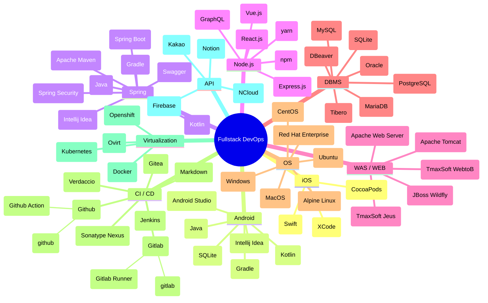

# {{ $frontmatter.description }} 관련

::: tip NOTE
{{ $frontmatter.description }} 관련 정리내용입니다.
:::

---

## <FontIcon icon="fas fa-bookmark"/>Bookmarks

<VPBanner
  title="Simple Icons"
  content="A 12 Lesson course teaching everything you need to know to start building Generative AI applications"
logo="https://camo.githubusercontent.com/51d3c9be20312bba33a3679ebd158fb478328e391bf8a91ca06e38a8792fd01b/68747470733a2f2f63646e2e73696d706c6569636f6e732e6f72672f73696d706c6569636f6e732f3030302f666666"
  :actions='[
    {
      text: "Visit Now",
      link: "https://simpleicons.org"
    }, {
      text: "Github",
      link: "https://github.com/simple-icons/simple-icons/blob/develop/slugs.md",
      type: "default"
    }
  ]'
/>

<VPBanner
  title="Awesome VuePress V2"
  content="A curated list of awesome things related to VuePress V2"
  logo="https://raw.githubusercontent.com/vuepress/awesome-vuepress/main/logo.png"
  :actions='[
    {
      text: "Visit Now",
      link: "https://github.com/vuepress/awesome-vuepress/blob/main/v2.md"
    }, {
      text: "Github",
      link: "https://github.com/vuepress/awesome-vuepress",
      type: "default"
    }
  ]'
/>

::: tabs

@tab:active Programming Tools - General

```component VPCard
{
  "title": "CyberChef",
  "desc": "The Cyber Swiss Army Knife - a web app for encryption, encoding, compression and data analysis",
  "link": "https://gchq.github.io/CyberChef",
  "logo": "https://raw.githubusercontent.com/gchq/CyberChef/master/src/web/static/images/logo/cyberchef.svg",
  "background": "rgba(24,116,206,0.2)"
}
```

```component VPCard
{
  "title": "web code tools",
  "desc": "The best code generators for developers",
  "link": "https://webcode.tools/",
  "logo": "https://webcode.tools/favicon.png",
  "background": "rgba(18,18,18,0.2)"
}
```

```component VPCard
{
  "title": "SmallDev.tools",
  "desc": "FREE tools for developers like encoder/decoder, HTML/CSS/Javascript formatters, minifiers, fake or test data generators & much more.",
  "link": "https://smalldev.tools/",
  "logo": "https://smalldev.tools/favicon.png",
  "background": "rgba(246,248,251,0.2)"
}
```

```component VPCard
{
  "title": "Can I Use?",
  "desc": "Can I use... Support tables for HTML5, CSS3, etc",
  "link": "https://caniuse.com/",
  "logo": "https://caniuse.com/img/favicon-128.png",
  "background": "rgba(131,53,2,0.2)"
}
```

```component VPCard
{
  "title": "Saaze",
  "desc": "An all-inclusive, flat-file CMS for simple websites and blogs",
  "link": "https://saaze.dev",
  "logo": "https://saaze.dev/assets/favicon.png",
  "background": "rgba(42,38,87,0.2)"
}
```


```component VPCard
{
  "title": "gitignore.io",
  "desc": "자신의 프로젝트에 꼭 맞는 .gitignore 파일을 만드세요",
  "link": "https://www.toptal.com/developers/gitignore",
  "logo": "https://www.toptal.com/developers/gitignore/img/toptal-logo-wordmark.svg",
  "background": "rgba(32,78,207,0.2)"
}
```

```component VPCard
{
  "title": "Timelock Encryption",
  "desc": "Send secrets into the future...",
  "link": "https://timelock.dev/",
  "logo": "🔒",
  "background": "rgba(33,37,41,0.2)"
}
```

```component VPCard
{
  "title": "Freehand",
  "desc": "Freehand – The all-in-one collaborative workspace<br/>Unlock your team’s full potential – ideate, plan, execute, and track projects with Freehand",
  "link": "https://www.invisionapp.com",
  "logo": "https://marketing.invisionapp-cdn.com/www.invisionapp.com/global-assets/search/invision-search-logo.png",
  "background": "rgba(73,10,164,0.2) "
}
```

```component VPCard
{
  "title": "JSONGenerator",
  "desc": "Create Random JSON Data<",
  "link": "https://www.jsongenerator.io",
  "logo": "https://www.jsongenerator.io/favicon.ico",
  "background": "rgba(51,118,205,0.2)"
}
```

```component VPCard
{
  "title": "SQL Workbench",
  "desc": "SQL Workbench - Rapid prototyping SQL Queries & Data Visualizations",
  "link": "https://sql-workbench.com/",
  "logo": "https://sql-workbench.com/icon.png",
  "background": "rgba(255,255,255,0.2)"
}
```

```component VPCard
{
  "title": "Mybatis Log Parser",
  "desc": "",
  "link": "https://comne.kr/mybatis/",
  "logo": "https://comne.kr/favicon.ico",
  "background": "rgba(18,18,18,0.2)"
}
```

```component VPCard
{
  "title": "Instant SQL Formatter & Beautifier Online",
  "desc": "Free online sql formatting tool, beautify sql code instantly for SQL Server, Oracle, DB2, MySQL, Sybase, Access and MDX",
  "link": "https://www.dpriver.com/pp/sqlformat.htm",
  "logo": "https://www.dpriver.com/pp/sqlpponline.png",
  "background": "rgba(255,198,79,0.2)"
}
```

```component VPCard
{
  "title": "Prompt Library",
  "desc": "Explore optimized prompts for a breadth of business and personal tasks.",
  "link": "https://docs.anthropic.com/claude/prompt-library",
  "logo": "https://files.readme.io/69d2014-favicon.ico",
  "background": "rgba(38,46,51,0.2)"
}
```

```component VPCard
{
  "title": "Kimchi Reader",
  "desc": "Your Ultimate Toolbox for Immersive Korean Language Learning",
  "link": "https://kimchi-reader.app/",
  "logo": "https://kimchi-reader.app/_app/immutable/assets/icon-full.4M8znj2G.svg",
  "background": "rgba(15,15,15,0.2)"
}
```

```component VPCard
{
  "title": "Database of Databases",
  "desc": "The on-line encyclopedia of databases systems from Carnegie Mellon University.",
  "link": "https://dbdb.io",
  "logo": "https://dbdb.io/static/core/images/favicon.ico",
  "background": "rgba(45,73,98,0.2)"
}
```

- [Operator Lookup](https://www.joshwcomeau.com/operator-lookup)
- [Sha256 Decrypt & Encrypt](https://md5decrypt.net/en/Sha256/#answer)

@tab Package Manager

```component VPCard
{
  "title": "Homebrew — The Missing Package Manager for macOS (or Linux)",
  "desc": "The Missing Package Manager for macOS (or Linux).",
  "link": "https://brew.sh/",
  "logo": "https://brew.sh/assets/img/homebrew.svg",
  "background": "rgba(46,42,36,0.2)"
}
```

```component VPCard
{
  "title": "Chocolatey Software | Packages",
  "desc": "Chocolatey is software management automation for Windows that wraps installers, executables, zips, and scripts into compiled packages. Chocolatey integrates w/SCCM, Puppet, Chef, etc. Chocolatey is trusted by businesses to manage software deployments.",
  "link": "https://community.chocolatey.org/packages",
  "logo": "https://community.chocolatey.org/content/images/global-shared/logo.svg",
  "background": "rgba(18,32,43,0.2)"
}
```

```component VPCard
{
  "title": "Scoop Apps",
  "desc": "Scoop Apps is an online package browser for Scoop, the command-line installer for Windows",
  "link": "https://bjansen.github.io/scoop-apps/main/",
  "logo": "https://bjansen.github.io/scoop-apps/favicon.ico",
  "background": "rgba(42,42,41,0.2)"
}
```


@tab Design & Image

```component VPCard
{
  "title": "Font Awesome",
  "desc": "The internet's icon library + toolkit. Used by millions of designers, devs, & content creators. Open-source. Always free. Always awesome.",
  "link": "https://fontawesome.com/search",
  "logo": "https://fontawesome.com/images/favicon/icon.svg",
  "background": "rgba(255,255,255,0.2)"
}
```

```component VPCard
{
  "title": "Iconbuddy — 200K+ open source free svg icons",
  "desc": "Iconbuddy is a search engine that allows you to search, download, customize, and edit over 200,000 open source svg icons for free.",
  "link": "https://iconbuddy.app",
  "logo": "https://c1.tablecdn.com/iconbuddy/iconbuddy-logo.png",
  "background": "rgba(237,63,99,0.2)"
}
```

```component VPCard
{
  "title": "Heroicons",
  "desc": "Beautiful hand-crafted SVG icons, by the makers of Tailwind CSS.",
  "link": "https://heroicons.com",
  "logo": "https://heroicons.com/_next/static/media/apple-touch-icon.822687be.png",
  "background": "rgb(242,236,250,0.2)"
}
```

```component VPCard
{
  "title": "Eraser",
  "desc": "♟️The Whiteboard for Engineering Teams",
  "link": "https://app.eraser.io",
  "logo": "https://app.eraser.io/favicon.svg",
  "background": "rgba(23,23,23,0)"
}
```

```component VPCard
{
  "title": "Diagrams - Diagram as Code",
  "desc": "Draw the cloud system architecture in Python code",
  "link": "https://diagrams.mingrammer.com",
  "logo": "https://diagrams.mingrammer.com/img/diagrams.ico",
  "background": "rgba(94,115,229,0.2)"
}
```

```component VPCard
{
  "title": "YT Pics",
  "desc": "Download pictures from Youtube videos",
  "link": "https://www.ytpics.com/",
  "logo": "https://www.ytpics.com/images/image-download.svg",
  "background": "rgba(17,17,17,0.2)"
}
```

```component VPCard
{
  "title": "v0.dev",
  "desc": "Generate UI with simple text prompts. Copy, paste, ship.",
  "link": "https://v0.dev/",
  "logo": "https://v0.dev/icon-19iptc.svg?94ebf4f1268986e0",
  "background": "rgba(24,24,27,0.2)"
}
```

```component VPCard
{
  "title": "TechIcons",
  "desc": "Download, copy and paste tech icons in SVG and PNG format for your projects.",
  "link": "https://techicons.dev/",
  "logo": "https://techicons.dev/tech-icons-logo.svg",
  "background": "rgba(48,131,220,0.2)"
}
```

```component VPCard
{
  "title": "네이버 - QR코드",
  "desc": "나만의 QR코드로 간편하게 정보를 담아보세요",
  "link": "https://qr.naver.com",
  "logo": "https://naver.com/favicon.ico",
  "background": "rgba(3,199,90,0.2)"
}
```

```component VPCard
{
  "title": "SVG Artista",
  "desc": "SVG Artista - SVG Drawing Animation Generator",
  "link": "https://svgartista.net",
  "logo": "https://svgartista.net/images/app-icon/safari-pinned-tab.svg",
  "background": "rgba(41,40,41,0.2)"
}
```

```component VPCard
{
  "title": "Free Favicon Maker",
  "desc": "Free Favicon Maker — Create SVG & PNG favicon in seconds!",
  "link": "https://formito.com/tools/favicon",
  "logo": "https://formito.com/favicon.ico",
  "background": "rgba(123,111,224,0.2)"
}
```

```component VPCard
{
  "title": "Database diagram",
  "desc": "Database Diagram Tool",
  "link": "https://databasediagram.com/app",
  "logo": "https://databasediagram.com/img/databasediagram.png",
  "background": "rgba(39,39,87,0.2)"
}
```

```component VPCard
{
  "title": "chalk.ist",
  "desc": "Create beautiful images of your source code",
  "link": "https://chalk.ist/",
  "logo": "https://chalk.ist/apple-touch-icon.png",
  "background": "rgba(11,11,13,0.2)"
}
```

```component VPCard
{
  "title": "D2 Playground",
  "desc": "An online runner to play, learn, and create with D2, the modern diagram scripting language that turns text to diagrams.",
  "link": "https://play.d2lang.com",
  "logo": "https://play.d2lang.com/assets/images/og.png",
  "background": "rgba(87,121,245,0.2)"
}
```

```component VPCard
{
  "title": "Hexcodle - The Daily Hexcode Guessing Game!",
  "desc": "Can you guess today's hexcode color? Challenge your color instincts and decode the hexcode with Hexcodle! Inspired by Wordle, but for color enthusiasts.",
  "link": "https://hexcodle.com/",
  "logo": "https://hexcodle.com/favicon.ico",
  "background": "rgba(227,232,239,0.2)"
}
```

```component VPCard
{
  "title": "shadeup.dev",
  "desc": "The power of WebGPU with just a few lines of code",
  "link": "https://shadeup.dev/browse",
  "logo": "https://shadeup.dev/logo.svg",
  "background": "rgba(74,39,116,0.2)"
}
```

```component VPCard
{
  "title": "Color Lisa - Curated Color Palette Masterpieces.",
  "desc": "Color Lisa is a curated list of inspiring color palettes based famous work of the world's greatest artists. Each palette was painstakingly created by color obsessed designers, artists, museum curators, and masters of color theory. ",
  "link": "https://colorlisa.com/",
  "logo": "https://colorlisa.com/icons/apple-touch-icon-152x152.png",
  "background": "rgba(9,175,253,0.2)"
}
```

```component VPCard
{
  "title": "Vectorpea | Online Vector Editor",
  "desc": "Vectorpea Online Vector Editor lets you edit vector graphics, AI, SVG and PDF files!",
  "link": "https://www.vectorpea.com/",
  "logo": "https://www.vectorpea.com/icon512.png",
  "background": "rgba(101,165,0,0.2)"
}
```

```component VPCard
{
  "title": "Typ.io: Fonts that go together",
  "desc": "Be better at typography.",
  "link": "https://typ.io/",
  "logo": "https://typ.io/typio.svg",
  "background": "rgba(255,255,255,0.2)"
  
}
```

```component VPCard
{
  "title": "Windows 98 Icon Viewer",
  "desc": "",
  "link": "https://win98icons.alexmeub.com/",
  "logo": "https://win98icons.alexmeub.com/favicon.ico",
  "background": "rgba(0,128,128,0.2)"
}
```

```component VPCard
{
  "title": "Ugly Avatar",
  "desc": "CREATED BY XUAN TANG, MORE INFO AT TXSTC55.GITHUB.IO",
  "link": "https://txstc55.github.io/ugly-avatar/",
  "logo": "https://txstc55.github.io/ugly-avatar/avatar.png",
  "background": "rgba(255,253,208,0.2)"
}
```

```component VPCard
{
  "title": "Browse Fonts - Google Fonts",
  "desc": "Making the web more beautiful, fast, and open through great typography",
  "link": "https://fonts.google.com/",
  "logo": "https://www.gstatic.com/images/icons/material/apps/fonts/1x/catalog/v5/favicon.svg",
  "background": "rgba(32,33,36,0.2)"
}
```

```component VPCard
{
  "title": "Visual Dictionary and Thesaurus | Graphwords.com",
  "desc": "Graphwords.com is a visual thesaurus and dictionary to help you explore English words. Find meanings of words and their associations in easy way using this online thesaurus tool. It's a tool that produces word maps that blossom with related words, branching out to synonyms and definitions.",
  "link": "https://graphwords.com/",
  "logo": "https://graphwords.com/img/favicon.png",
  "background": "rgba(176,208,209,0.2)"
}
```

```component VPCard
{
  "title": "PromptHero - Search prompts for Stable Diffusion, ChatGPT & Midjourney",
  "desc": "The #1 website for Artificial Intelligence and Prompt Engineering. Search the world's best AI prompts for models like Stable Diffusion, ChatGPT, Midjourney...",
  "link": "https://prompthero.com/",
  "logo": "https://prompthero.com/favicon/apple-touch-icon.png",
  "background": "rgba(115,67,89.0.2)"
}
```

```component VPCard
{
  "title": "공공누리",
  "desc": "",
  "link": "https://www.kogl.or.kr/index.do",
  "logo": "https://www.kogl.or.kr/static/kogl/img/common/logo.png",
  "background": "rgba(0,165,137,0.2)"
}
```

@tab Geospatial

```component VPCard
{
  "title": "epsg.io: Transform coordinates",
  "desc": "Online converter for lat & long coordinates, geodetic datums and projected systems",
  "link": "https://epsg.io/transform#s_srs=5186&t_srs=5187",
  "logo": "https://epsg.io/favicon.ico",
  "background": "rgba(255,255,255,0.2)"
}
```

```component VPCard
{
  "title": "Spatial Reference",
  "desc": "Spatial Reference List -- Spatial Reference",
  "link": "https://spatialreference.org/ref/epsg",
  "logo": "https://spatialreference.org/favicon.ico",
  "background": "rgba(225,217,214,0.2)"
}
```

```component VPCard
{
  "title": "GPS Coordinates",
  "desc": "GPS Coordinates - Latitude and Longitude Finder",
  "link": "https://gps-coordinates.org",
  "logo": "https://gps-coordinates.org/images/logo.gif",
  "background": "rgba(33,166,33,0.2)"
}
```

```component VPCard
{
  "title": "OsmAPP",
  "desc": "A universal OpenStreetMap app",
  "link": "https://osmapp.org/#7.00/37.3666/126.9512",
  "logo": "https://osmapp.org/logo/osmapp_256.png",
  "background": "rgba(66,66,66,0.2)"
}
```

```component VPCard
{
  "title": "WaterwayMap.org - OSM River Basins",
  "desc": "A unique, topological, view on rivers & waterways in OpenStreetMap, showing how they are connected. Find mistakes and make better maps.",
  "link": "https://waterwaymap.org/#map=2/0/0",
  "logo": "https://waterwaymap.org/img/osm.png",
  "background": "rgba(255,255,255,0.2)"
}
```

```component VPCard
{
  "title": "Sit In Shade",
  "desc": "Find Best Seat to Minimize Sun Exposure While Traveling - Sit In Shade",
  "link": "https://sitinshade.com/",
  "logo": "https://sitinshade.com/favicon.ico",
  "background": "rgba(10,10,10,0.2)"
}
```

```component VPCard
{
  "title": "overpass turbo",
  "desc": "A web based data mining tool for OpenStreetMap which runs any kind of Overpass API query and shows the results on an interactive map.",
  "link": "https://overpass-turbo.eu/",
  "logo": "https://overpass-turbo.eu/assets/favicon.ico",
  "background": "rgb(62,196,135,0.2)"
}
```

```component VPCard
{
  "title": "Spacetime maps",
  "desc": "This is a map that can show time instead of space. Distances in the map reflect travel times: points that are close but take a long time to travel between (by car) get pushed away from each other, and vice versa.",
  "link": "https://spacetime-maps.vercel.app/",
  "logo": "https://spacetime-maps.vercel.app/logo192.png",
  "background": "rgba(10,10,10,0.2)"
}
```

```component VPCard
{
  "title": "The Astro App | Explore the Night Sky",
  "desc": "The Astro App (early access) is a tool for exploring the night sky and tracking celestial events. It's primarily targeted for amateur astrophotographers.",
  "link": "https://astro.sshh.io/",
  "logo": "https://astro.sshh.io/logo192.png",
  "background": "rgba(30,41,59,0.2)"
}
```

```component VPCard
{
  "title": "CityDensity.com",
  "desc": "",
  "link": "https://citydensity.com/",
  "logo": "https://citydensity.com/logo.png",
  "background": "rgba(248,248,248,0.2)"
}
```

```component VPCard
{
  "title": "DWG to SHP Converter Online - MyGeodata Cloud",
  "desc": "Discover fast and easy to use online conversion and transformation tool to convert DWG to SHP format - widely used in AutoCAD, ESRI ArcGIS and ArcView.",
  "link": "https://mygeodata.cloud/converter/dwg-to-shp",
  "logo": "https://mygeodata.cloud/favicon.ico",
  "background": "rgba(51,122,183,0.2)"
}
```
- [Convert DWG to SHP Online](https://mygeodata.cloud/converter/dwg-to-shp)

@tab Network & Security

```component VPCard
{
  "title": "permission.site",
  "desc": "A site to test the interaction of web APIs and browser permissions.",
  "link": "https://permission.site/",
  "logo": "https://permission.site/app-icon.png",
  "background": "rgb(238,238,238,0.2)"
}
```

```component VPCard
{
  "title": "DNS Propagation Checker - Global DNS Testing Tool",
  "desc": "Instant DNS Propagation Check. Global DNS Propagation Checker - Check DNS records around the world.",
  "link": "https://www.whatsmydns.net",
  "logo": "https://www.whatsmydns.net/apple-touch-icon.png",
  "background": "rgba(39,76,113,0.2)"
}
```

```component VPCard
{
  "title": "forensictools",
  "desc": "",
  "link": "https://cristian.sh/projects/forensictools.html",
  "logo": "https://cristian.sh/projects/forensictools_full.png",
  "background": "rgba(47,52,63,0.2)"
}
```

```component VPCard
{
  "title": "STARLINKMAP.ORG - Real-Time Starlink Satellite Tracker",
  "desc": "Track the Starlink satellite constellation in real-time.",
  "link": "https://www.starlinkmap.org/",
  "logo": "https://www.starlinkmap.org/favicon.ico",
  "background": "rgb(127,29,29,0.2)"
}
```

```component VPCard
{
  "title": "PDF 잠금해제",
  "desc": "PDF 비밀번호를 온라인으로 제거하세요. PDF 파일의 비밀번호 보안을 제거하세요.",
  "link": "https://www.ilovepdf.com/ko/unlock_pdf",
  "logo": "https://www.ilovepdf.com/img/favicons-pdf/favicon-32x32.png",
  "background": "rgba(229,50,45,0.2)"
}
```

- [htaccess tester](https://htaccess.madewithlove.com)

@tab Documentation

```component VPCard
{
  "title": "vuepress-plugin-components",
  "desc": "Useful components for VuePress2",
  "link": "https://plugin-components.vuejs.press",
  "logo": "https://theme-hope-assets.vuejs.press/logo.svg",
  "background": "rgb(62,175,124,0.2)"
}
```

```component VPCard
{
  "title": "vuepress-plugin-md-enhance",
  "desc": "Enhancement for Markdown in VuePress",
  "link": "https://plugin-md-enhance.vuejs.press/",
  "logo": "https://theme-hope-assets.vuejs.press/logo.svg",
  "background": "rgb(62,175,124,0.2)"
}
```

```component VPCard
{
  "title": "VuePress Theme Hope",
  "desc": "A VuePress theme with tons of features✨",
  "link": "https://theme-hope.vuejs.press/guide/",
  "logo": "https://theme-hope-assets.vuejs.press/logo.svg",
  "background": "rgb(62,175,124,0.2)"
}
```

- [github-opensource-guide](https://opensource.guide): Open source software is made by people just like you. Learn how to launch and grow your project.
- [youtube-documentation](https://developers.google.com/youtube/documentation): 
- [jshint](https://jshint.com): JSHint

@tab Misc.

```component VPCard
{
  "title": "Download youtube subtitles, download SRT YouTube for free.",
  "desc": "Download subtitles is a free web application that can download subtitles directly from Youtube",
  "link": "https://downloadyoutubesubtitle.com/",
  "logo": "https://downloadyoutubesubtitle.com/favicon.ico",
  "background": "rgba(250,245,255,0.2)"
}
```

```component VPCard
{
  "title": "스팸 전화번호 데이터베이스",
  "desc": "사용자가 만드는 스팸 전화번호 데이터베이스",
  "link": "https://www.missed-call.com",
  "background": "rgba(148,10,18,0.2)"
}
```

```component VPCard
{
  "title": "대출이자 계산기",
  "desc": "대출이자 계산기, 대출이자 자동계산기, 원리금균등상환 계산기, 원금균등상환 계산기, 원금만기일시상환 계산기, 대출금리계산기, 대출이자 계산방법, 대출이자율 계산기, 주택담보대출이자계산, 은행대출이자 계산, 대출이자 계산법",
  "link": "http://calc.funstory.biz/",
  "background": "rgba(40,164,229,0.2)"
}
```

```component VPCard
{
  "title": "사람인 - 연봉계산기",
  "desc": "...",
  "link": "https://www.saramin.co.kr/zf_user/tools/salary-calculator",
  "background": "rgba(255,255,255,0.2)"
}
```

```component VPCard
{
  "title": "ffmprovisr",
  "desc": "Making FFmpeg Easier",
  "link": "https://amiaopensource.github.io/ffmprovisr/",
  "logo": "https://amiaopensource.github.io/ffmprovisr/img/vhs.ico",
  "background": "rgba(6,6,6,0.2)"
}
```

```component VPCard
{
  "title": "FFmpeg Explorer!",
  "desc": "",
  "link": "https://ffmpeg.lav.io",
  "background": "rgba(255,255,255,0.2)"
}
```

```component VPCard
{
  "title": "binvis.io",
  "desc": "visual analysis of binary files",
  "link": "https://binvis.io/#/",
  "logo": "",
  "background": "rgba(255,255,255,0.2)"
}
```

```component VPCard
{
  "title": "ambient.garden",
  "desc": "An Algorithmic Audio Landscape",
  "link": "https://ambient.garden/",
  "logo": "https://ambient.garden/favicon.ico",
  "background": "rgba(10,10,10,0.2)"
}
```

```component VPCard
{
  "title": "ambiphone. ambient music + sounds for work, study and relaxation.",
  "desc": "Ambient music + sounds for work, study and relaxation",
  "link": "https://ambiph.one/"
  "logo": "https://ambiph.one/img/app-icons/apple-touch-icon.png",
  "background": "rgba(201,161,111,0.2)"
}
```

```component VPCard
{
  "title": "MemChess",
  "desc": "Learn chess openings and variations online by repeating the most popular chess Master moves",
  "link": "https://grondilu.github.io/memchess/",
  "logo": "https://grondilu.github.io/memchess/img/favicon.png",
  "background": "rgba(10,10,10,0.2)"
}
```

```component VPCard
{
  "title": "SlideSynth",
  "dsec": "Touch to make sound. Move touch up and down to change frequency. Move touch left and right to change volume. Tap the logo to loop, tap again to stop looping, tap yet again to cancel the loop. Tap the waveform icons to change the waveform.",
  "link": "https://slidesynth.com/",
  "logo": "https://slidesynth.com/icon.svg",
  "background": "rgba(121,30,29,0.2)"
}
```

```component VPCard
{
  "title": "Infinite Craft",
  "desc": "A crafting game where you can make anything. No really it's pretty much endless I think.",
  "link": "https://neal.fun/infinite-craft/",
  "logo": "https://neal.fun/favicons/infinite-craft.png",
  "background": "rgba(255,255,255,0.2)"
}
```

```component VPCard
{
  "title": "The Grid",
  "desc": "With the Grid's founding nearly 10 years ago we embarked on an expedition to the unknown that clearly wasn't your typical valley-safe niche but none of us expected this... Trust we are heads-down, all-in, no plan-b devoted to returning and sharing the bounty.",
  "link": "https://thegrid.io/",
  "logo": "https://thegrid.io/favicon.ico",
  "background": "rgba(229,52,840.2)"
}
```

```component VPCard
{
  "title": "Product Chart - Interactive Product Comparison Charts",
  "desc": "A new way to discover products. Each chart gives you an easy to grasp overview of what is available on the market, and provides the tools to find the product that is perfect for you. Choose a category and try it out",
  "link": "https://www.productchart.com/",
  "logo": "https://www.productchart.com/favicon.ico",
  "background": "rgba(242,101,34,0.2)"
}
```

- https://viperfish.com.au/games/pinnacle.html
- https://workout.olzhasar.com/
- https://allrgb.com/kd-tree
- https://oneminutefocus.com/
- https://foldmation.com/
- https://truncate.town/
- https://susam.net/myrgb.html
- https://pykidos.github.io/
- https://parallel-arabic.com/
- https://afterthebeep.tel/
- https://dalle.party/
- https://bbycroft.net/llm
- https://puter.com/

:::

---


```mermaid
mindmap
  root((Fullstack DevOps))
    iOS
      B1(Swift)
      B2(XCode)
      B3(CocoaPods)
    Android
      C1(Java)
      C2(Kotlin)
      C3(Intellij Idea)
      C4(Android Studio)
      C5(Gradle)
      C6(SQLite)
    Spring
      D1(Java)
      D2(Kotlin)
      D3(Intellij Idea)
      D4(Gradle)
      D5(Apache Maven)
      D6(Spring Security)
      D7(Spring Boot)
      D8(Swagger)
    Node.js
      G1(npm)
      G2(yarn)
      G3(React.js)
      G4(Vue.js)
      G5(Express.js)
      G6(GraphQL)
    WAS / WEB
      E1(Apache Tomcat)
      E2(JBoss Wildfly)
      E3(Apache Web Server)
      E4(TmaxSoft Jeus)
      E5(TmaxSoft WebtoB)
    DBMS
      F1(DBeaver)
      F2(Oracle)
      F3(MySQL)
      F4(MariaDB)
      F5(SQLite)
      F6(PostgreSQL)
      F7(Tibero)
    OS
      H1(Windows)
      H2(MacOS)
      H3(Ubuntu)
      H4(CentOS)
      H5(Red Hat Enterprise)
      H6(Alpine Linux)
    CI / CD
      I1(Jenkins)
      I2(Github)
        I2a(Github Action)
        I2b(github)
      I3(Gitlab)
        I3a(Gitlab Runner)
        I3b(gitlab)
      I4(Gitea)
      I5(Verdaccio)
      I6(Sonatype Nexus)
      I7(Markdown)
    Virtualization
      J1(Docker)
      J2(Kubernetes)
      J3(Openshift)
      J4(Ovirt)
    API
      K1(Firebase)
      K2(Kakao)
      K3(NCloud)
      K4(Notion)
```

---