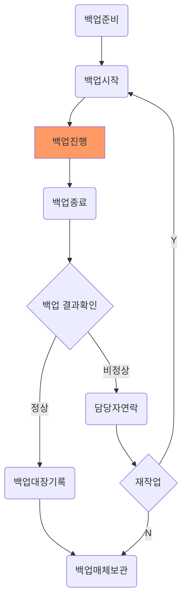

## 절차도


```mermaid
stateDiagram-v2
  [*] --> A: 산출물 제공

  participant A as "주관기관(KLID)"
  participant B as "PM"
  participant C as "형상관리담당자"
  participant D as "기능개선담당자"
  A ->> B: 산출물 제공
  note 이전사업 결과물
  B ->> C: 베이스라인 설정

  

```

## 


  
::: details Click here to view code

```mermaidjs
flowchart TD
A(백업준비) --> B(백업시작)
B --> C[백업진행] 
C:::someclass --> D(백업종료)
D --> E{백업 결과확인}
E -->|정상| F(백업대장기록)
F --> G(백업매체보관)
E -->|비정상| I(담당자연락)
I --> J{재작업}
J -->|Y| B
J -->|N| G
classDef someclass fill:#f96
```
:::
