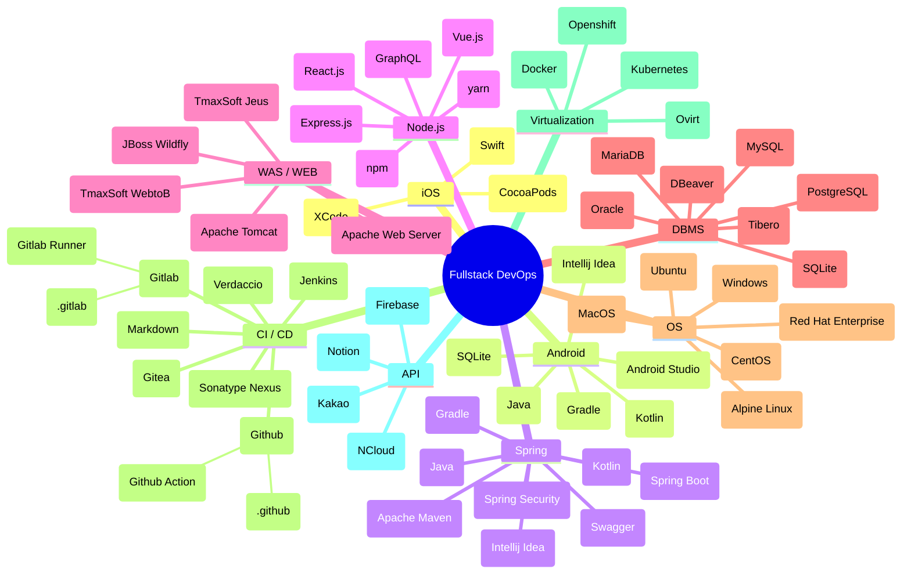

<div class="features">
  <div class="feature">
    <a target="_blank" href="https://github.com/chanhi2000">
      
      <h2>github.com/chanhi2000</h2>
      <quote>My Github</quote>
    </a>
    <br/>
    <br/>
  </div>
  <div class="feature">
    <a target="_blank" href="https://www.notion.so/MarkiiimarK-c231ae6c157d4baba89a3713c92449dd">
      
      <h2>notion.so/chanhi2000</h2>
      <quote>Chan's Temporary Portfolio</quote>
    </a>
    <br/>
    <br/>
  </div>
  <div class="feature"></div>
  <div class="feature">
    <span style="display:flex;flex-direction:row;justify-content:flex-start;align-items:center">
      
      <p style="display:flex;justify-content:center;align-items:flex-start;flex-direction:column;">
        <a target="_blank" href="https://simpleicons.org" ></a>
        <a target="_blank" href="https://github.com/simple-icons/simple-icons/blob/develop/slugs.md"></a>
      </p>
    </span>
  </div>
  <div class="feature">
    <span style="display:flex;flex-direction:row;justify-content:flex-start;align-items:center">
      
      <p style="display:flex;justify-content:center;align-items:flex-start;flex-direction:column">
        <a target="_blank" href="https://v2.vuepress.vuejs.org/guide/"></a>
        <a target="_blank" href="https://github.com/vuepress/awesome-vuepress/blob/main/v2.md"></a>
      </p>
    </span>
    <br/>
  </div>
<div class="feature">
    <h2>🗞️</h2>
    <ul>
      <li><a target="_blank" href="https://remoteok.com">🌐Remote OK</a></li>
      <li><a target="_blank" href="https://fossfox.com">💼FossFox : work in open-source & get paid for it</a></li>
      <li><a target="_blank" href="https://datatau.net">DataTau</a></li>
      <li><a target="_blank" href="https://zsync.xyz">ZSync</a></li>
      <li><a target="_blank" href="https://keyframes.app">more tools for devs</a></li>
      <li><a target="_blank" href="https://alistapart.com">a list apart</a></li>
      <li><a target="_blank" href="https://app.eraser.io">♟️The Whiteboard for Engineering Teams</a></li>
      <li><a target="_blank" href="https://gpte.ai">Discover the latest tools and trends in AI 🔮</a></li>
      <li><a target="_blank" href="https://www.jsongenerator.io">JSON Generator</a></li>
    </ul>
  </div>
</div>

```card
title: GeekNews
desc: 개발/기술/스타트업 뉴스 서비스
link: https://news.hada.io
logo: https://news.hada.io/logo.png
color: rgba(56, 59, 64, 0.2)
```

```card
title: AI News - TILNOTE
desc: GPT-4가 큐레이션한 AI에 대한 뉴스입니다. 구독하시면 매일 아침 8시 뉴스를 받아보실 수 있습니다.
link: https://tilnote.io/news
logo: https://tilnote.io/favicon-32x32.png
color: rgba(255, 255, 255, 0.2)
```

```card
title: Auto Wiki
desc: View high-quality, automatically generated documentation for any public GitHub repository.
link: https://wiki.mutable.ai
logo: https://app.mutable.ai/favicon.png
color: rgba(255,255,255,0.2)
```

```card
title: Next AI News
desc: A full-stack replica of HN using Next.js and AI generated content. (https://github.com/rauchg/next-ai-news)
link: https://next-ai-news.vercel.app
logo: https://next-ai-news.vercel.app/favicon.ico
color: rgba(255, 153, 102, 0.2)
```

```card
title: 비즈니스를 위한 무료 웹 서비스 모음
dess: 무료로도 유용하게 사용할 수 있는 온라인 웹 서비스들을 총 망라했습니다.
link: https://kidow.notion.site/0fc89df5906e4b918bd25b059b0f56a6
logo: https://kidow.notion.site/image/https%3A%2F%2Fs3-us-west-2.amazonaws.com%2Fsecure.notion-static.com%2F87c7f48f-35bf-4937-a48b-6d668f1ecb16%2FGroup_117.png?table=block&id=0fc89df5-906e-4b91-8bd2-5b059b0f56a6&spaceId=aa404725-54fb-4102-b842-1b14f9803432&width=250&userId=&cache=v2
color: rbga(20,20,20,0.2)
```

```card
title: 해시넷
desc: 대한민국 블록체인 및 암호화폐 정보포털
link: http://wiki.hash.kr
logo: http://www.hash.kr/images/main/logo_big.png
color: rbga(20,20,20,0.2)
```

```card
title: 머니플뉴스
desc: AI가 대신 읽어주는 뉴스
link: https://newsgpt.web.app
logo: https://newsgpt.web.app/logo192.png
color: rgba(46, 46, 46, 0.2)
```

```card
title: Crescendo
desc: 소규모 스터디 플랫폼
link: https://www.crescendo-study.site/
logo: https://www.crescendo-study.site/svg/logo_symbol.svg
color: rgb(127,68,170,0.2)
```

```card
title: ByteByteGo
desc: ByteByteGo Newsletter
link: https://blog.bytebytego.com
logo: https://substackcdn.com/image/fetch/w_96,c_limit,f_auto,q_auto:good,fl_progressive:steep/https%3A%2F%2Fbucketeer-e05bbc84-baa3-437e-9518-adb32be77984.s3.amazonaws.com%2Fpublic%2Fimages%2F8a5609ae-1239-4400-9491-6010a15c4d60_504x504.png
color: rgba(140, 234, 216, 0.2)
```

```card
title: 🦊인포그랩
desc: GitLab기반 DevSecOps 구축,컨설팅,교육,기술지원 서비스 제공
link: https://insight.infograb.net/blog
logo: https://insight.infograb.net/img/logo-color.svg
color: rgba(23, 149, 106, 0.2)
```

```card
title: Hidden Tools
desc: ✨ Discover a wide collection of unique tools.
link: https://hiddentools-eight.vercel.app
logo: https://hiddentools-eight.vercel.app/favicon.ico
color: rgba(10, 10, 10, 0.2)
```

```card
title: DevTools Tips
desc: The collection of tips useful for web development.
link: https://devtoolstips.org
logo: https://devtoolstips.org/assets/logo-small.png
color: rgba(27, 44, 43, 0.2)
```

```card
title: Diagrams - Diagram as Code
desc: Draw the cloud system architecture in Python code
link: https://diagrams.mingrammer.com
logo: https://diagrams.mingrammer.com/img/diagrams.ico
color: rgba(94, 115, 229, 0.2)
```

```card
title: Onsites.fyi
desc: Learn from hundreds of real tech interview experiences!
link: https://www.onsites.fyi
logo: https://www.onsites.fyi/favicon.ico
color: rgba(190, 242, 100, 0.2)
```

```card
title: HackerStartup
desc: Useful SaaS Kits & starter templates for developers to build your next project faster
link: https://hackerstartup.com/
logo: https://hackerstartup.com/favicon.ico
color: rgba(79,29,173,0.2)
```


<ShieldsGroup 
  logos="github,gitlab,swift,java,spring,springboot,springsecurity,kotlin,csharp,dotnet,css3,javascript,typescript,jquery,nodedotjs,react,vuedotjs,apachemaven,apachecordova,npm,cocoapods,gradle,subversion,mysql,mariadb,graphql,sqlite,oracle,docker,kubernetes,synology,jenkins,firebase,kakao,gitea,notion,postman,redhatopenshift,naver"
/>

<GithubInfoGenBox />
<YouTubeInfoGenBox />
  
<DevGithubItems />
<DevHackerNewsItems />
<!-- <DataTauItems /> -->
<!-- <ZSyncItems /> -->


