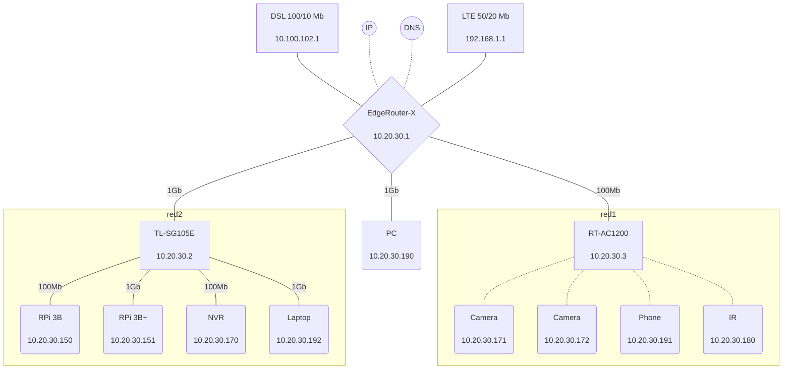

# {{ $frontmatter.title }} 관련

[[toc]]

---

## Flowchart

### Simple

::: tabs

@tab:active Diagram


@tab Code

```mermaidjs
graph TD;
    A-->B;
    A-->C;
    B-->D;
    C-->D;
```

:::

### Live Network Diagram Influxdb Grafana

> [link](https://mermaid-js.github.io/mermaid-live-editor/edit#pako:eNqFlGFr2zAQhv-K0KeW1Y6kkLUNobAloRTSEuIwBvM-yJbWiNmykOWVkuS_75zEdhx76weB7nzvq3tORlscZ0LiMX613GzQehZqlCj9O3DviURC_uJF4pDSTlqTJdxJFPFc5VD1xjX9MYll-elhFiwQJWRACXqOJpF9KBclPuRgMZ9OBqfKn57n2ayA7bYSz8WrXB1S3vczLSP-kJwp93CoMldXlawse1pWgrrs-trzTyeAQOi8rZi9BB9IAIzVYIv1HI3IgLW47gHo851Pe7HA4biBzA74n6MdN7Xfau19mVJGSAd02Hi1LR6jnYlrhuW0O6J70qB0tPmbcvGmbmC98IJHSkbzjg1rNZAX0fGXsFJQiLmBGcU8pXUnU55Ky7vd3NJWN5WQfSxkXaHZZFo28GXUw99zorK16mnVldy1Rya1uGBmZXwYXXOPRjX0q6VCw69d41Hb-MyivEfFLgw-9TjQfzkcmtB_GrKXbz1ot__rIOHGZaY2WBzCnomyy_HgGwy3lnIl4LHYQg6F2G1kKkM8hu3ppQhxqPdQWhgBb8VcKJdZPHa2kDeYFy4L3nVcxceameIw8_SY3P8F0FRzsw)

::: tabs 

@tab:active Diagram



@tab Code

```mermaidjs
graph TD
  linkStyle default interpolate basis
  wan1[<center>DSL 100/10 Mb<br><br>10.100.102.1</center>]---router{<center>EdgeRouter-X<br><br>10.20.30.1</center>}
  ip((<center><br>IP<br><br></center>))-.-router
  dns((<center><br>DNS<br><br></center>))-.-router
  wan2[<center>LTE 50/20 Mb<br><br>192.168.1.1</center>]---router
  router---|100Mb|ap[<center>RT-AC1200<br><br>10.20.30.3</center>]
  router---|1Gb|pc(<center>PC<br><br>10.20.30.190</center>)
  router---|1Gb|switch[<center>TL-SG105E<br><br>10.20.30.2</center>]
  subgraph red1
    ap-.-cam1(<center>Camera<br><br>10.20.30.171</center>)
    ap-.-cam2(<center>Camera<br><br>10.20.30.172</center>)
    ap-.-phone(<center>Phone<br><br>10.20.30.191</center>)
    ap-.-ir(<center>IR<br><br>10.20.30.180</center>)
  end   
  subgraph red2
    switch---|100Mb|pi1(<center>RPi 3B<br><br>10.20.30.150</center>)
    switch---|1Gb|pi2(<center>RPi 3B+<br><br>10.20.30.151</center>)
    switch---|100Mb|nvr(<center>NVR<br><br>10.20.30.170</center>)
    switch---|1Gb|laptop(<center>Laptop<br><br>10.20.30.192</center>)
  end
```

---

## Sequence

```sequence
    participant Alice
    participant Bob
    Alice->>John: Hello John, how are you?
    loop Healthcheck
        John->>John: Fight against hypochondria
    end
    Note right of John: Rational thoughts <br/>prevail!
    John-->>Alice: Great!
    John->>Bob: How about you?
    Bob-->>John: Jolly good!
```

::: details Click here to view code

```mermaidjs
sequenceDiagram
    participant Alice
    participant Bob
    Alice->>John: Hello John, how are you?
    loop Healthcheck
        John->>John: Fight against hypochondria
    end
    Note right of John: Rational thoughts <br/>prevail!
    John-->>Alice: Great!
    John->>Bob: How about you?
    Bob-->>John: Jolly good!
```

:::

---

## Gantt

```gantt
dateFormat  YYYY-MM-DD
title       Adding GANTT diagram functionality to mermaid
excludes    weekends
%% (`excludes` accepts specific dates in YYYY-MM-DD format, days of the week ("sunday") or "weekends", but not the word "weekdays".)

section A section
Completed task            :done,    des1, 2014-01-06,2014-01-08
Active task               :active,  des2, 2014-01-09, 3d
Future task               :         des3, after des2, 5d
Future task2              :         des4, after des3, 5d

section Critical tasks
Completed task in the critical line :crit, done, 2014-01-06,24h
Implement parser                    :crit, done, after des1, 2d
Create tests for parser             :crit, active, 3d
Future task in critical line        :crit, 5d
Create tests for renderer           :2d
Add to mermaid                      :1d

section Documentation
Describe gantt syntax               :active, a1, after des1, 3d
Add gantt diagram to demo page      :after a1  , 20h
Add another diagram to demo page    :doc1, after a1  , 48h

section Last section
Describe gantt syntax               :after doc1, 3d
Add gantt diagram to demo page      :20h
Add another diagram to demo page    :48h
```

::: details Click here to view code

```mermaidjs
gantt
dateFormat  YYYY-MM-DD
title Adding GANTT diagram to mermaid
excludes weekdays 2014-01-10

section A section
Completed task            :done,    des1, 2014-01-06,2014-01-08
Active task               :active,  des2, 2014-01-09, 3d
Future task               :         des3, after des2, 5d
Future task2               :         des4, after des3, 5d
```

:::

---

## Class

```class
Class01 <|-- AveryLongClass : Cool
Class03 *-- Class04
Class05 o-- Class06
Class07 .. Class08
Class09 --> C2 : Where am i?
Class09 --* C3
Class09 --|> Class07
Class07 : equals()
Class07 : Object[] elementData
Class01 : size()
Class01 : int chimp
Class01 : int gorilla
Class08 <--> C2: Cool label
```

::: details Click here to view code

```mermaidjs
classDiagram
Class01 <|-- AveryLongClass : Cool
Class03 *-- Class04
Class05 o-- Class06
Class07 .. Class08
Class09 --> C2 : Where am i?
Class09 --* C3
Class09 --|> Class07
Class07 : equals()
Class07 : Object[] elementData
Class01 : size()
Class01 : int chimp
Class01 : int gorilla
Class08 <--> C2: Cool label
```

:::

---

<TagLinks />