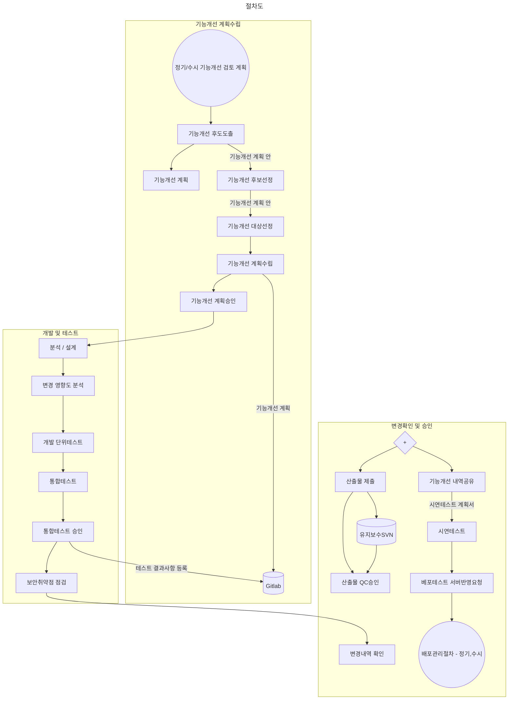

# {{ $frontmatter.title }} 관련

[[toc]]

---

## 절차도



```plantuml
---
title: 절차도
---
sequenceDiagram
  participant A as 품질관리자
  participant B as 개발 통합테스트 담당자
  participant C as 기능개선 관리자
  participant D as 한국지역정보개발원
  participant E as 행정안전부
  C->>C: 정기/수시 기능개선 검토회의
  C->>C: 기능개선 후보도출
  note right of C: 기능개선 계획(안)
  C->>D: 기능개선 후보선정
  note right of D: 기능개선 계획(안)
  D->>E: 기능개선 대상선정
  E->>C: 기능개선 계획수립
  C->>D: 기능개선 계획승인
  D->>B: 분석/설계
  B->>C: 변경 영향도 분석
  C->>B: 개발 단위테스트
  B->>B: 통합테스트
  B->>C: 통합테스트 승인
  note right of C: 테스트 결과사항 등록
  C->>D: Gitlab
  C->>C: 보안취약점 점검
  C->>A: 변경내역 확인
  A->>B: 산출물제출
  B->>A: 산출물 QC승인
  A->>C: 기능개선 내역공유
```

---

<TagLinks />