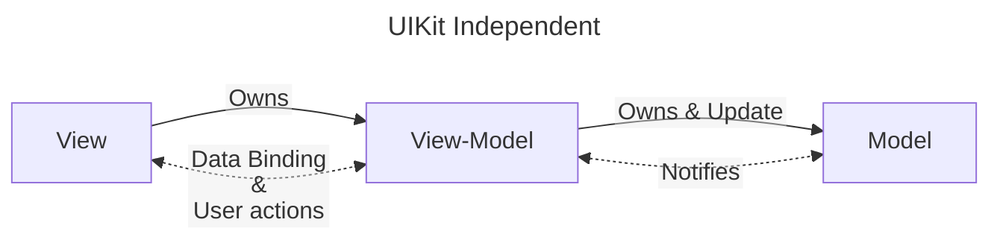

# {{ $frontmatter.title }} 관련

[[toc]]

---

## XCode

---

## Foundation Improvements

### Attributed Strings

- New __string type__: has character counting like strings
- Are __localisable__: also allowing for __interpolation__
- Has __markdown support__

```swift
// Attributed String
var exampleString = AttributedString("Hello")
exampleString.font = .italicSystemFont(ofSize: 20)

// Attributed Container
var container = AttributedContainer()
container.foregroundColor = .systemRed
container.backgroundColor = .gray
container.kern = 2.0

var userName = AttributedString("@vikingskullapps")
userName.mergeAttributes(container)
```

### makrdown support

- Attributed strings can now be created with __markdown__
- SwiftUI __Text views support__ makrdown syntax

```swift
let markdownExample = try AttributedString(markdown: "**Hello** _world_!")

// Text
Text("**VikingSkullApps** - [instagram](https://instagram.com/vikingskullapps)")
```

### date formatter

- New API: improved __usability__ and __performance__ with a __declarative approach__
- No need to __cache date formatters__

```swift
let currentDate = Date()
let date = currentDate.formatted(.dateTime.day().month().year()) // Oct 25, 2021
let dayYear = currentDate.formatted(.dateTime.day().year()) // 2021 (day:25)
let onlyDate = currentDate.formatted(date: .numeric, time: .omitted) // 10/25/2021
let dateLong = currentDate.formatted(date: .long, time: .complete) // October 25, 2021, 11:56:25 PM GMT+1
```

---

## MVVM Architecture Pattern in Swift

::: details MVVM Architecture Pattern in Swift

### What is MVVM

MVVM stands for __Model-View-ViewModel__. It's an architecture pattern form structuring and building apps.

MVVM decouples the UI code from the business logic by introducing a mediator called __ViewModel__.

MVVM is great way to lim down the somewhat huge __ViewControllers__ that requires several model-to-view transformations.

It also make __testability__ easy. since the ViewModel contains all the logic & knows nothing about the view.

Let's go over the MVVM diagram to get a better understanding of how it all works

### MVVM Diagram



Let's deep dive and understand the functionalities of each of the components with a demo

### 1. Model

Model defines core types & implements app business logic. It is independent of View and View-Model.

It contains the application data. Its purpose is to fetch the data from an API/database and provide it to the View-Model.

It also provides for CRUD operations that can be invoked by the View-Model on user interactions.

Usually, there's only one model exposed and used by the View-Models.The rest of the models interact with each other.

For example, let's create a model that the View-Models will interact with. Name it as `DataManager`.

```swift
import Foundation

struct DataManager {
    // MARK:- variables
    static var shared: DataManager = {
        return DataManager()
    }()

    let networkManager: NetworkManager

    // MARK:- inistializers
    init(networkManager: NetworkManager = NetworkManagers()) {
        self.networkManager = networkManager
    }

    // MARK:- functions
    func getPosts(page: Int, limit: Int, onCompletion: @escaping([Post]?, Error?) -> ()) {
        let queries: [String: Any] = ["page": page, "limit": limit]

        self.networkManager.getPosts(queries: queries) { (res, error) in 
            if (error == nil) {
                onCompletion(res, nil)
            }
        }
    }
}
```

- `DataManager` uses the `NetworkingManager` model internally.
- The `getPosts()` function takes in an offset, and a limit. It prepares the query and passes it to the `networkManager`. On success, it passes the data to the View-Model.

### 2. View-Model

Logic resides in the View-Models. They own the __Models__ and provides the data to the __View__. It is `UiKit` independent representation of your __View__ and its state.

__View-Model__ s have variables whose values are updated when the __Model__ returns the value.

Depending on your use case, you can choose to make your __View-Model__ as `struct` or a `class`.

There are many ways to notify the View. I prefer using Bindings, for that we'll need to create a small class called `Box`.

> I'll cover the View-Model here. You can find the `Box` class in the project.

```swift
import Foundation

struct PostListViewModel {
    // MARK:- variables
    let dataManager: DataManager

    var posts: Box<[Post]?> = Box[nil]

    var offset: Box<Int> = Box(0)
    var limit: Box<Int> = Box(30)

    // MARK:- initializer
    init(dataManager: DataManager = DataManager()) {
        self.dataManager = dataManager
        self.getPosts()
    }

    // MARK:- functions
    func getPosts() {
        self.dataManager.getPosts(offset: offset.value, limit: limit.value) { (posts, error) in 
            guard let posts = posts else { return }
            self.posts.value = posts
            self.offset.value = posts.count
        }
    }

}
```

- Let's create a View-Model named `PostListViewModel` that uses the `DataManager`.
- On initialization it calls the `getPosts()` function.

If the results are returned by the function, the `posts` and the `offset` variables are updated

### 3. View

MVVM treats the ViewContrller as a view.

View defines the layout, appearance of the UI. It informs the View-Model about the user interactions.

__View__ owns an instance of the View-Model.

The __View__ gets notified whenever there is a change in the data/state by the View-Model __bindings__.

For user actions, the __View__ invokes the functions provided by the View-Model.

Let's add a `tableView` to our ViewController, and use the View-Model for the data.

```swift
import UIKit

class HomeViewController: UIViewController {
    // MARK:- outlets
    @IBOutlet weak var tableView: UITableView!

    // MARK:- variables
    var postListViewModwl: PostListViewModel!

    // MARK:- lifecycle
    override func viewDidLoad() {
        super.viewDidLoad()
        self.postListViewModel = PostListViewModel()
        self.postListViewModel.posts.bind {
            if ($0 != nil) {
                self.tableView.reloadData()
            }
        }
    }
}

extension HomeViewController: UITableViewDataSource, UITableViewDelegate {
    func tableView(_ tableView: UITableView, numberOfRowsInSection section: Int) -> Int {
        guard let posts = self.postListViewModel.posts.value else { return 0 }
        return posts.count
    }

    func tableView(_ tableView: UITableView, cellForRowAt indexPath: IndexPath) -> UITableViewCell {
        guard let posts = self.postListViewModel.posts.value else { return UITableViewCell() }
        let cell = UITableViewCell()
        cell.textLabel?.text = posts[indexPath.row].title
        return cell
    }
}
```

- The __View-Model__ is initialized by the ViewController
- The ViewController listens to the `posts` variable of the View-Model by binding
- When the `posts` variable is set by the View-Model, the binding closure is called and the `tableView` gets reloaded.
- The TableView obtains the values from the View-Model and displays them

:::

---

## How to Use Realm Database in Swift

### What is Realm?

Realm is an open-source, cross-platform mobile database solution that you can integrate directly in your iOS projects.

Realm provides a developer-friendly alternative to __CoreData__ and __SQLite__ for storing and fetching data.

In __Realm__, the data gets directly exposed as objects, and they are queryable by code. It is quite intuitive and easy to pick up.

Realm removes the need for ORM that causes performance and maintenance issues. It is faster than even raw __SQLite__
operations.

Let us take a look at the steps for Integrating Realm and using them into an iOS project.

### 1. Configure Realm

First and foremost, you need to add realm to your project. You can use either __CocoaPods__, __Carthage__, or __Swift Package Manager__ to do that.

> Note: SPM require min. target to be iOS 11

Let us go over the basics of Realm

1. __Realm Instance__: A Realm instance represents a Realm database. They can either be stored on disk or in memory.
2. __Realm Configuration__: A Configuration instance describes the different options used to create an instance of a Realm. They are plain structs.
3. __Object__: An Object is a class that defines Realm Model entities. In Realm, you define your Model classes by subclassing the Object class and adding the required properties to be stored to it.

```swift
import Foundation
import RealmSwift

class RealmManager {

    //MARK:- functions
    class func realmConfig() -> Realm.Configuration {
        return Realm.Configuration(schemaVersion: 2, migrationBack: { (migration, oldSchemaVersion) in
            // Migration block. Useful when you upgrade the schema version

        })
    }

    private class func realmInstance() -> Realm {
        do {
            let newRealm = try Realm(configuration: realmConfig())
            return newReam
        } catch {
            fatalError("Unable to create an instance of Realm")
        }
    }
}
```

- We start by creating a service class for handling everything related to Realm. Let's call it `RealmManager`.
- `RealmConfiguration` has a `schemaVersion` and a closure. When you update your `schemaVersion`, you can use this block to migrate data.
- `realmInstance()` takes the declared configuration and provides an instance. We use this instance to perform operations on Realm.

Now, we need to write functions for performing the CRUD operations in Realm. Let's create a protocol and add the required functions to it.

```swift
private protocol RealmOperations {
    // write operation
    static func write<T: Object>(_ object: T?, block: @escaping ((Realm, T?) -> Void))
    
    // adds a single object to Realm
    static func add(_ object: Object)
    
    // adds a list of objects to Realm
    static func add<S: Sequence>(_ objects: S) where S.Iterator.Element: Object
    
    // gets objects from Realm that satisfy the given predicate
    static func get<R: Object> (fromEntity entity: R.Type, 
                                withPredicate predicate: NSPredicate?, 
                                sortedByKey sortKey: String?, 
                                inAscending isAscending: Bool) -> Results<R>

    // deletes a single object from Realm static func delete( object: Object)
    // deletes a list of object from Realm
    static func delete<S: Sequence>(_ objects: S) where S.Iterator.Element: Object

    // deletes an Entity from Realm based on the given predicate
    static func delete(fromEntity entity: Object. Type, withPredicate predicate: NSPredicate?)

    // updates and overwrites a Realm object
    static func update<T: Object>(_object: T, block: @escaping ((T) -> Void))
}
```

The __write__ function writes data to Realm, and is used by the __add__, __delete__ and __update__ functions.

> PS: I'm leaving the implementation of the functions in this post( You can pick it up from my GitHub project, they are to be used as is).

### 2. Create Object Models

The next step involves creating __Models__ that conform to __Object__ class. Each Model __Type__ is stored as a separate entity inside Realm.

Realm supports the following properties.

```swift
Bool - @objc dynamic var value = false 
Int - @objc dynamic var value = 0
Float - @objc dynamic var value: Float = 0.0
Double - @objc dynamic var value: Double = 0.0 
String - @objc dynamic var value = "" 
Data - @objc dynamic var value = Data() 
Date - @objc dynamic var value = Date()
```

Points to keep in mind when creating a __Realm Model__

1. They must be declared as a class and inherit the Object class. 
2. The properties/variables have to be prefixed with @`objc dynamic var`.
3. You need to override the `primaryKey()` function and set a primary key.
4. You need to override the `ignoredProperties()` function for computed vars.

Let me show you how you can __store__ an array of Objects received from a `GET` Request. To do this, we'll also need to conform to the Decodable protocol.

```swift
/// JSON structure
let json = """
}
  "id": 1,
  "num": "001",
  "name": "Bulbasaur",
  "ing": "http://www.serebii.net/pokemongo/pokemon/001.png",
  "height": 0.71",
  "weight": "6.9 kg",
}
""".data(using: utf8)
```

> JSON structure, that we store.

```swift
class Pokemon: Object, Decodable {
    @objc dynamic var id: Int = 8 
    @objc dynamic var pokemonNumber: String = ""

    @objc dynamic var name: String = "" 
    @objc dynamic var imageURL: String = ""

    @objc dynamic var height: String = "" 
    @objc dynamic var weight: String = ""

    private enum CodingKeys: String, Codingkey {    
        case id = "id"
        case pokemonNumber = "num"
        case name = "name"
        case imageURL = "img"

        case height = "height"
        case weight = "weight"
    }

    // MARK:- initializers
    override required init() {
        super.init()
    }

    // Primary Key is declared here. REQUIRED
    override static func primaryKey() -> String? {
        return "id"
    }

    // properties that are either computed and lazy are mentioned here
    // since Realm cannot store them.
    override static func ignoredProperties() -> [String] {
        [**]
    }
}
```

you can see the created Model. It is a class, and it implements the
`Decodable` protocol as well as `Realm` Object.

### 3. Perform Operations

Now that we have created the model, we call the API and store its response to Realm. We use the __ADD__ function of Realm Manager.

```swift
let urlstring = "https://raw.githubusercontent.com/Biuni/PokemonGO-Pokedex/master/pokedex.json" 
let task = URLSession.shared.dataTask(with: URL(string: urlString)!) { (data,, error) in 
    if (error == nil) {
        guard let data data else { return }
        do {
            let pokemonResponse = try JSONDecoder().decode(PokemonResponse.self, from: data) print("Pokemon count", pokemonResponse.pokemon.count)
            
            // ADD & STORE the data to Realm
            RealmManager.add(pokemonResponse.pokemon)
        } catch { print(error) }
    }
}
task.resume()
```

We can now perform queries on the data stored in Realm. Let us see some examples, starting with `GET` queries

#### GET queries

```swift
// gets all entries stored inside Pokemon entity
print(RealmManager.get(fromEntity: Pokemon.self))

// gets all entries stored inside Pokemon entity in descending order 
print(RealmManager.get(fromEntity: Pokemon.self, withPredicate: nil,
                        sortedByKey: "pokemonNumber", 
                        inAscending: false))                                            

// gets all entries from Pokemon entity whose id is greater than or equal to 100
print(RealmManager.get(fromEntity: Pokemon.self, 
                       withPredicate: NSPredicate (format: "id >= %d", 100)))
/// gets all pokemons from Pokemon entity whose names begin with A
print(RealmManager.get(fromEntity: Pokemon.self, 
                       withPredicate: NSPredicate (format: "name begins with %@", "A"), 
                       sortedByKey: "pokemonNumber", 
                       inAscending: true))
```

#### DELETE queries

```swift
// deletes entires from Pokemon entity that contains 'mew' in its name 
print(RealmManager.delete(RealmManager.get(fromEntity: Pokemon.self,
                                           withPredicate: NSPredicate (format: "name contains [cd] %@", "new"))))
// deletes all pokemons from Pokemon entity whose names begin with 'C' 
print(RealmManager.delete(RealmManager.get(fromEntity: Pokemon.self,
                                           withPredicate: NSPredicate (format: "name begins with %@", "C"),
                                           sortedByKey: "pokemonNumber", 
                                           inAscending: true)))
```

#### UPDATE queries

```swift
// fetch Pikachu's entry from Pokemon entity and changes the name to 'PIKACHU'
guard let pikachu = RealmManager.get(fromEntity: Pokemon.self, 
                                     withPredicate: NSPredicate (format: "pokemonNumber = %@", "025")
).first else { return }

RealmManager.update(pikachu) { (newObject) in 
    // update the name to allCAPS
    pikachu.name = pikachu.name.uppercased()
}
```

---

## Unit Testing

::: details Unit Testing

Unit Tests are automated tests that run and validate function in your project and makes sure they behave as intended and meet their design. Using `XCTAssert` function we can dictate whether an expression should b true, false, equal, nil, etc. Xcode uses the `XCTest` framework in order to perform these Unit Tests

### Create a new swift file and add this code

```swift
import Foundation

class Car {
    var brand: CarBrand
    var model: CarModel
    var feulType: FeulType
    var parkingSpot: Int?
    var horsepower: Int

    init(brand: CarBrand, model: CalModel, feulType: FeulType, hosepower: Int, parkingSpot: Int?) {
        self.brand = brand
        self.model = model
        self.feulType = feulType
        self.parkingSpot = parkingSpot
        self.horsepower = horsepower
    }

    func moveToParkingSpot(spot: Int) {
        parkingSpot = spot
    }
    func leaveParkingSpot() { 
        parkingSpot = nil
    }
    func installSuperCharger() {
        horsepower = horsepower * 2
    }
}

enum FeulType {
    case gas
    case diesel
    case hybrid
}

enum CarBrand {
    case Honda
    case Acura
    case BMW
    case Volkswagen
}

enum CarModel {
    case Civic
    case CSX
    case M3
    case Jetta
}
```

### Testing Code ...

```swift
import XCTest
@testable import UnitTesting

class UnitTestingTests: XCTestCase {
    var car1: Car!
    var car2: Car!

    override func setUp() {
        super.setUp()
        car1 = Car(brand: .Honda, model: .Civic, feulType: .gas, horssepower: 115, parkingSpot: 1)
        car2 = Car(brand: .Volkswagen, model: .Jetta, feulType: .diesel, horsepower: 100, parkingSpot: 1)
    }

    override func tearDown() {
        super.tearDown()
        car1 = nil
        car2 =nil
    }

    func testIfCarsHaveNoParkingSpot() {
        let cars = [car1, car2]
        for car in cars {
            car?.leaveParkingSpot()
        }
        XCTAssertTrue(car1.parkingSpot == nil && car2.parkingSpot == nil)
    }

    func testIfCarsAreNotInTheSameParkingSpot() {
        car1.moveToParkingSpot(spot: 2)
        XCTAssertTrue(car1.parkingSpot != car2.parkingSpot)
    }

    func testIfJettaHasMoreHorsePower() {
        car2.installSuperCharger()
        XCTAssertTrue(car1.horsepower < car2.horsepower)
    }
}
```

:::

---

## Extension(s)

### String

#### Printing optionals without `Optional(…)` wrapping

We can define custom interpolation for any optional value which supports conversion to a string.

```swift
import Foundation

extension String.StringInterpolation {
    mutating func appendInterpolation<T: CustomStringConvertible>(
        _ value: T?
    ) {
        appendInterpolation(value ?? placeholder(for: T.self))
    }
    
    private func placeholder<T> (
        for type: T.Type
    ) -> CustomStrintConvertible {
        "nil (\(type)?)" as CustomStringConvertible
    }
}
```


<TagLinks />